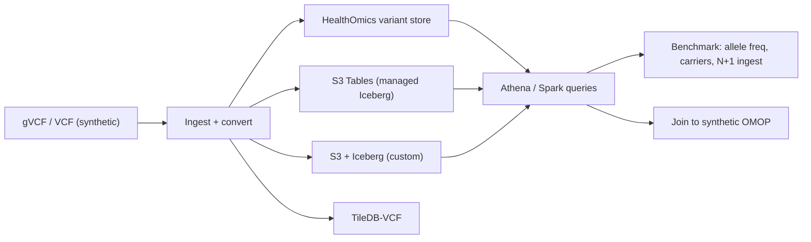

# hls-variant-store-aws

> Companion **starter** lab for the [Health & Life Science Solution Bootcamp](https://github.com/anothernoise/hls-sa).
> The full reference solution lives in the private `hls-bootcamp-solutions` repo.

Design, build, and **benchmark** a population-scale **genomic variant store on AWS** across
four implementation strategies — then join it to clinical (OMOP) data. The lab teaches the
trade-offs an SA weighs when storing and querying variants at scale.

## What you build



## The four strategies

| Strategy | Managed? | Engine | What you learn |
| --- | --- | --- | --- |
| **HealthOmics variant store** | Fully managed | Athena / Lake Formation | Managed genomics + provenance |
| **S3 Tables** | Managed Iceberg | Athena / Spark | Open Iceberg without table ops |
| **S3 + Iceberg (custom)** | DIY | Athena / Spark / Trino | Partitioning, file sizing, schema evolution |
| **TileDB-VCF** | Self-run | TileDB API / Spark | Sparse-array variant storage |

## The exercises

1. **Ingest** a synthetic cohort of gVCFs into each store.
2. **Query** the same questions on each: allele frequency across the cohort, carriers of a
   variant, and a gene roll-up.
3. **Benchmark** query latency/cost and the **N+1** incremental-ingest behaviour.
4. **Join** the variant store to a synthetic [OMOP](https://github.com/anothernoise/hls-sa) clinical table (genotype ↔ phenotype).
5. **Govern** — apply Lake Formation column controls and KMS; treat variants as high-sensitivity PHI.

## Repo layout

```
.
├── docs/architecture.md      # design write-up, options, trade-offs
├── ingest/                   # VCF→store loaders per strategy (stub)
├── queries/                  # benchmark queries (stub)
├── deploy/                   # IaC (stub)
└── samples/                  # synthetic gVCFs + OMOP clinical data
```

> **Status:** scaffold. Architecture and lab plan documented; loaders/IaC stubbed.
> **Synthetic data only — genomic data is inherently identifying; never commit real data.**

## License

Proprietary — part of the Health & Life Science Solution Bootcamp. See the
[bootcamp license](https://github.com/anothernoise/hls-sa/blob/main/LICENSE); ask before reuse.
