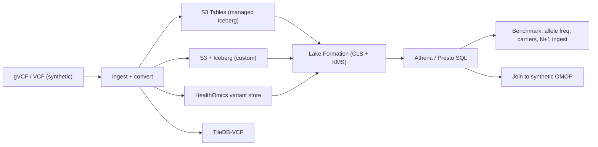

# hls-variant-store-aws

> Companion **starter** lab for the [Health & Life Science Solution Bootcamp](https://github.com/anothernoise/hls-sa).
> The full reference solution lives in the private `hls-bootcamp-solutions` repo.

Design, build, and **benchmark** a population-scale **genomic variant store on AWS** across
four implementation strategies — then join it to clinical (OMOP) data. The lab teaches the
trade-offs an SA weighs when storing and querying variants at scale.

## What you build



## Architecture Strategies Compared

| Strategy | Architecture Model | Primary Engine | Key Trade-off / Learning |
| :--- | :--- | :--- | :--- |
| **S3 Tables** | Managed Iceberg Lakehouse | Athena / Spark | Zero-ops compaction, automated table bucket maintenance |
| **S3 + Iceberg (custom)** | Self-Managed Lakehouse | Athena / Spark / Trino | Open Iceberg format, custom partition transforms (`reference_name`) |
| **Delta Lake on S3** | Databricks / ACID Lakehouse | Athena / Spark / Databricks | Parquet + `_delta_log` commits, Liquid Clustering skipping |
| **Hail VDS on S3** | Distributed Sparse MatrixTable | Apache Spark / Hail | Split Variant/Reference matrix optimized for GWAS and statistical genetics |
| **Aurora PostgreSQL** | Relational Serverless v2 | PostgreSQL 16 (JSONB) | Sub-10ms indexed point lookups, auto-scaling 0.5–2 ACUs, instant OLTP joins |
| **RDS PostgreSQL** | Relational Provisioned Instance | PostgreSQL 16 (JSONB) | Low-cost steady baseline for dev metadata and targeted carrier lookups |
| **TileDB-VCF** | Multi-dimensional Sparse Array | TileDB API / Spark | Microsecond range slices for dense population cohort queries |
| **HealthOmics** | Fully Managed Genomics Store | Athena / Lake Formation | Fully managed AWS genomics engine with provenance tracking |


## The Exercises

Full step-by-step instructions are available in the **[Lab Exercises Guide](docs/exercises.md)**:

1. **Ingest**: Load synthetic gVCF cohorts into Amazon S3 Tables and Custom S3 Iceberg.
2. **Query**: Run identical SQL queries across both engines (allele frequency, carrier lookup, gene burden).
3. **Benchmark**: Measure latency, data scanned, Athena costs, and the $N+1$ incremental ingest speedup.
4. **Join**: Correlate genomic variant carriers to synthetic [OMOP](https://github.com/anothernoise/hls-sa) clinical conditions without data movement.
5. **Govern**: Enforce AWS Lake Formation column projection filters and KMS Customer Managed Keys.
6. **Explore & Visualize**: Interactive multi-engine exploration web app (`app/app.py`) with Plotly Dash, supporting dynamic backend switching across 7 storage architectures.

## Architecture Decision Records (ADRs)

All core technical decisions and trade-offs are documented in [`docs/adr/`](docs/adr/):
- [ADR-001: Storage Strategy Selection](docs/adr/ADR-001-variant-storage-strategy-selection.md)
- [ADR-002: Solving the N+1 Incremental Ingestion Problem](docs/adr/ADR-002-n-plus-1-incremental-ingestion.md)
- [ADR-003: PHI Governance & Column-Level Security](docs/adr/ADR-003-phi-governance-and-column-level-security.md)
- [ADR-004: Multimodal Genotype-Phenotype Federation (OMOP CDM)](docs/adr/ADR-004-multimodal-genotype-phenotype-federation.md)

## Repo Layout

```
.
├── app/                      # Interactive Plotly Dash multi-engine explorer web app
│   ├── app.py                # Dash UI layout, multi-engine dropdown & 5 discovery tabs
│   ├── backend.py            # Data access abstraction layer (Athena + deterministic fallback)
│   └── requirements.txt      # Web app Python dependencies
├── deploy/terraform/         # Terraform IaC (S3 Tables, Iceberg, Athena, RDS, Aurora, HealthOmics, KMS)
├── docs/
│   ├── architecture.md       # Solution design, trade-offs, and NFRs
│   ├── summary.md            # SA evaluation matrix, decision tree, Well-Architected pillars
│   ├── exercises.md          # Step-by-step lab exercise guide (Exercises 1 through 6)
│   └── adr/                  # Architecture Decision Records (ADR-001 through ADR-004)
├── samples/
│   ├── generate_synthetic_data.py # Deterministic multi-sample gVCF & OMOP generator
│   └── data/                 # Generated synthetic VCF and OMOP CSV datasets
├── ingest/
│   ├── s3tables/             # Ingestion loader for Amazon S3 Tables
│   ├── custom_iceberg/       # Partition-aware loader for Custom S3 + Iceberg
│   └── healthomics/          # Lifecycle & async VCF import manager for AWS HealthOmics
├── queries/
│   ├── s3tables/             # Athena Presto/Trino SQL queries for S3 Tables
│   └── custom_iceberg/       # Athena Presto/Trino SQL queries for Custom Iceberg
├── scripts/
│   └── validate_exercises.py # Automated validation CLI (local-mode and live aws-mode)
├── benchmarks/
│   ├── benchmark_runner.py   # Latency, scan volume, cost & N+1 speedup benchmark harness
│   ├── live_performance_report.md # Empirical Athena execution & cost telemetry
│   └── README.md             # Benchmark methodology and formulas
├── governance/
│   └── lakeformation_policy.md # Threat model and column access control matrix
└── tests/                    # Unit test suite for loaders and benchmark calculations
```

## Quick Start & Verification

### 1. Generate Synthetic Data
```bash
python3 samples/generate_synthetic_data.py
```

### 2. Run Automated Lab Validation (Offline / Local)
```bash
python3 scripts/validate_exercises.py --local-mode
```

### 3. Launch Interactive Plotly Dash Multi-Engine Explorer
```bash
pip install -r app/requirements.txt
python3 app/app.py
# Open http://localhost:8050 to dynamically switch between all 7 backend storage engines
```

### 4. Run Unit Tests & Local Benchmarks
```bash
python3 -m unittest discover tests
python3 benchmarks/benchmark_runner.py --cohort-size 10
```

### 5. Deploy Infrastructure (AWS)
```bash
cd deploy/terraform
cp terraform.tfvars.example terraform.tfvars
terraform init
terraform plan
terraform apply
```

### 6. Validate Live Deployment (AWS Athena & KMS)
```bash
python3 scripts/validate_exercises.py --aws-mode
```

> **Synthetic data only — genomic data is inherently identifying; never commit real data.**

## License

Proprietary — part of the Health & Life Science Solution Bootcamp. See the
[bootcamp license](https://github.com/anothernoise/hls-sa/blob/main/LICENSE); ask before reuse.
