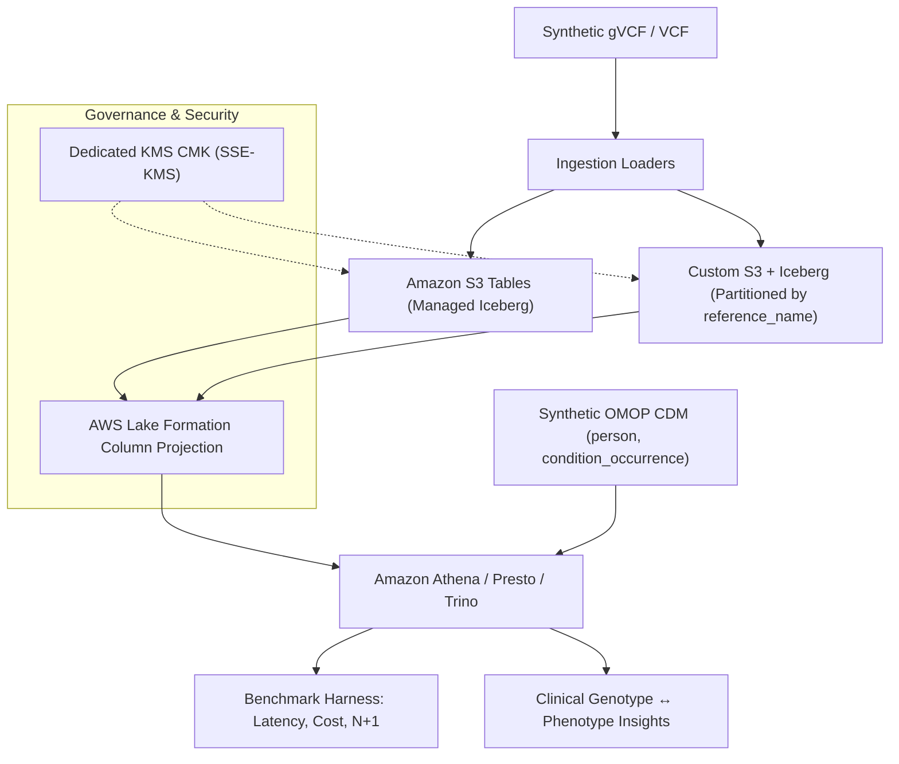

# Architecture: Genomic Variant Store on AWS

## Problem

Store called variants for a growing cohort so that cross-sample questions (allele frequency,
carriers, gene roll-ups) are fast and cheap, new samples can be added incrementally (the
**N+1 problem**), and the data can be joined to clinical phenotypes — all under PHI-grade
governance.

## Architecture Decisions (ADRs)

Detailed architectural choices, trade-off evaluations, and compliance analyses are recorded in:
- [ADR-001: Storage Strategy Selection](adr/ADR-001-variant-storage-strategy-selection.md)
- [ADR-002: Solving the N+1 Incremental Ingestion Problem](adr/ADR-002-n-plus-1-incremental-ingestion.md)
- [ADR-003: PHI Governance & Column-Level Security](adr/ADR-003-phi-governance-and-column-level-security.md)
- [ADR-004: Multimodal Genotype-Phenotype Federation (OMOP CDM)](adr/ADR-004-multimodal-genotype-phenotype-federation.md)

## Forces & Non-Functional Requirements (NFRs)

- **Cross-sample query performance** at population scale (columnar pruning, partitioning by `reference_name`).
- **Incremental ingest**: adding sample N+1 must not reprocess all N ($O(1)$ write amplification via Iceberg manifests).
- **Joinability** to clinical (OMOP) data without data movement or fragile ETL pipelines.
- **Governance**: genomic data is inherently re-identifying — treated as high-sensitivity PHI with Lake Formation column controls.
- **Cost**: compute-dominated; minimize scan and egress (\$5.00/TB Athena standard rate).

## Implemented Architectures

## Strategy Evaluation & Trade-offs

| Strategy | Managed? | Engine | What you learn |
| :--- | :--- | :--- | :--- |
| **Amazon S3 Tables** | Managed Iceberg | Athena / Spark | Open Iceberg format with automated table maintenance & compaction |
| **Custom S3 + Iceberg** | DIY | Athena / Spark / Trino | Hive-style partitioning (`reference_name`), small-file management, manifest commits |
| **HealthOmics variant store** | Fully managed | Athena / Lake Formation | Managed genomics with AWS-native provenance |
| **TileDB-VCF** | Self-run | TileDB API / Spark | Columnar sparse-array engine for multi-sample variant matrices |

## Governance & Security Architecture

1. **Customer Managed KMS Key**:
   All S3 Table Buckets, custom warehouse buckets, and Athena query result locations are encrypted with a dedicated KMS CMK. S3 Tables maintenance principals (`tables.s3.amazonaws.com`) and Athena engines receive explicit policy grants.
2. **Lake Formation Column-Level Security**:
   - **Researcher Role**: Can query de-identified genomic locus attributes (`reference_name`, `start`, `end`, `ref`, `alt`, `qual`, `filter`, `dp`, `gq`, `attributes`). Sensitive PHI columns (`sample_id`, `genotype`, `allele_depth`) are blocked.
   - **Clinical Steward Role**: Full access across all columns for clinical correlation.
3. **Audit Trails**:
   Full CloudTrail data events logging for all S3 and Athena query activities.
