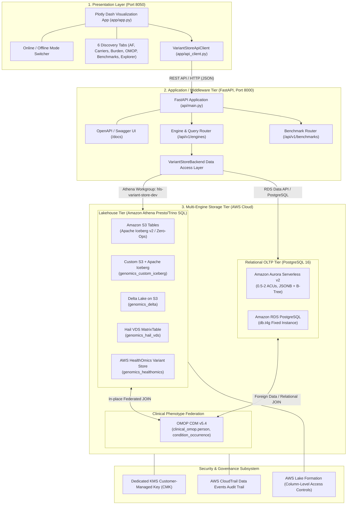

# Architecture: Genomic Variant Store on AWS

## Overview & System Objective

The **AWS Genomic Variant Store** is a population-scale reference architecture for storing, querying, and governing multimodal genomic and clinical data. It addresses the **N+1 incremental ingestion problem** (adding sample $N+1$ without reprocessing the existing $N$ samples), minimizes analytical query latency and costs, and provides in-place cross-modal federation with **OMOP Common Data Model (CDM) v5.4** clinical phenotypes under strict HIPAA/PHI security governance.

---

## Three-Tier Solution Architecture

The platform is structured into three decoupled tiers: **Presentation (Dash UI)**, **Middleware (FastAPI REST Service)**, and **Multi-Engine Storage Tier (AWS Lakehouse & Relational Databases)**.



---

## Dual Execution Modes: Online vs. Offline

The architecture supports dynamic switching between **Live AWS Cloud Execution** and **Local Deterministic Simulation**:

```mermaid
flowchart LR
    subgraph UI ["User / UI App Action"]
        Toggle["Navbar Execution Mode Switch"]
    end

    subgraph Routing ["Middleware Query Dispatch"]
        CheckMode{"Is Online Mode?"}
    end

    subgraph OnlineBranch ["Online Mode: Real Cloud Execution"]
        AthenaRun["Execute Amazon Athena Presto/Trino SQL\n(Workgroup: hls-variant-store-dev)"]
        AuroraRun["Execute Aurora PostgreSQL via RDS Data API"]
        RealTelemetry["Capture Empirical Telemetry:\n- EngineExecutionTimeInMillis\n- DataScannedInBytes\n- Target Database & Catalog"]
    end

    subgraph OfflineBranch ["Offline Mode: Air-gapped Simulation"]
        LocalData["Load Local Synthetic Baseline:\n- cohort_10samples.vcf\n- OMOP person.csv & condition.csv"]
        MockTelemetry["Deterministic Telemetry:\n- SLA Latency: 18.5 ms\n- Data Scanned: 0 bytes\n- Mode Flag: 'offline'"]
    end

    Toggle --> CheckMode
    CheckMode -->|Yes (Switch ON)| AthenaRun & AuroraRun
    AthenaRun & AuroraRun --> RealTelemetry
    CheckMode -->|No (Switch OFF)| LocalData
    LocalData --> MockTelemetry
```

---

## Architecture Decision Records (ADRs)

Detailed architectural choices, trade-off evaluations, and compliance analyses are recorded in:
- [ADR-001: Storage Strategy Selection](adr/ADR-001-variant-storage-strategy-selection.md)
- [ADR-002: Solving the N+1 Incremental Ingestion Problem](adr/ADR-002-n-plus-1-incremental-ingestion.md)
- [ADR-003: PHI Governance & Column-Level Security](adr/ADR-003-phi-governance-and-column-level-security.md)
- [ADR-004: Multimodal Genotype-Phenotype Federation (OMOP CDM)](adr/ADR-004-multimodal-genotype-phenotype-federation.md)

---

## 7 Storage Architectures Compared

| # | Storage Engine | Architecture Class | Format & Protocol | Catalog Integration | Partitioning / Indexing | Typical SLA | Cost Profile |
|---|---|---|---|---|---|---|---|
| 1 | **Amazon S3 Tables** | Managed Lakehouse | Apache Iceberg v2 | `s3tablescatalog/genomics` | `identity(reference_name)` | ~400 ms | $0.023/GB + serverless compaction |
| 2 | **Custom S3 + Iceberg** | Self-Managed Lakehouse | Apache Iceberg v2 | `genomics_custom_iceberg` | Hive `reference_name` partition | ~450 ms | $0.023/GB standard S3 storage |
| 3 | **Delta Lake on S3** | Databricks ACID Lakehouse | Delta Lake Protocol 3.x | `genomics_delta` | Liquid Clustering (`start`, `sample_id`) | ~420 ms | S3 standard + minimal metadata log |
| 4 | **Hail VDS (Spark)** | Distributed Sparse Matrix | Hail VDS 0.2 Parquet | `genomics_hail_vds` | Range-partitioned intervals | ~1.2 s | EMR / Spark ephemeral compute |
| 5 | **Aurora PostgreSQL** | Relational Serverless v2 | PostgreSQL 16 Heap | `genomics_relational` (public) | B-Tree `(reference_name, start)` + GIN JSONB | <50 ms | Auto-scaling 0.5–2 ACUs |
| 6 | **RDS PostgreSQL** | Relational Provisioned | PostgreSQL 16 Heap | `genomics_relational` (public) | Composite B-Tree + JSONB | <75 ms | Predictable fixed instance cost |
| 7 | **AWS HealthOmics** | Fully Managed Genomics | AWS Omics Variant Store | `genomics_healthomics` | Managed GRCh38 sharding | ~480 ms | $0.04/GB managed storage |

---

## FastAPI Middle Layer Specification

The FastAPI middle layer (`api/main.py`) provides typed OpenAPI endpoints on port 8000:

| Endpoint | Method | Description | Query Parameters |
|---|---|---|---|
| `/api/v1/health` | `GET` | Health check & version verification | None |
| `/api/v1/engines` | `GET` | Lists all 7 storage architectures and configuration | None |
| `/api/v1/engines/{id}` | `GET` | Physical architecture metadata for engine `{id}` | None |
| `/api/v1/engines/{id}/allele-frequencies` | `GET` | Cohort allele frequency aggregation | `offline: bool` |
| `/api/v1/engines/{id}/carrier-lookup` | `GET` | Point query for pathogenic variants (e.g. APP rs63750066) | `gene: str`, `offline: bool` |
| `/api/v1/engines/{id}/gene-burden` | `GET` | Sample-level mutation burden rollup | `gene: str`, `offline: bool` |
| `/api/v1/engines/{id}/omop-phenotype-join` | `GET` | Cross-modal federated join with OMOP CDM | `offline: bool` |
| `/api/v1/engines/{id}/raw-records` | `GET` | Direct table inspection with live SQL preview | `table_name`, `chromosome`, `sample_id`, `limit`, `offline` |
| `/api/v1/benchmarks` | `GET` | Multi-engine latency and cost SLA benchmarks | None |

Interactive documentation is available at:
- **Swagger UI**: `http://localhost:8000/docs`
- **ReDoc**: `http://localhost:8000/redoc`

---

## Governance & Security Architecture

1. **KMS Customer-Managed Encryption Key (CMK)**:
   All S3 Table Buckets, Iceberg warehouses, Delta stores, and Athena query result locations are encrypted using AWS KMS with key policies enforcing least privilege for `tables.s3.amazonaws.com` and Athena execution roles.
2. **Lake Formation Column-Level Security (CLS)**:
   - **Researcher Persona**: Authorized to query non-identifying variant attributes (`reference_name`, `start`, `end`, `ref`, `alt`, `qual`, `filter`, `dp`, `gq`, `attributes`). Direct PHI identifiers (`sample_id`, `genotype`, `allele_depth`) are masked or blocked.
   - **Clinical Geneticist Persona**: Full column projection to correlate pathogenic mutations with patient clinical records.
3. **AWS Profile Enforcement**:
   Per strict architectural policy, all AWS operations are restricted to the narrow `default` profile in `us-east-1` with least-privilege IAM policies.

