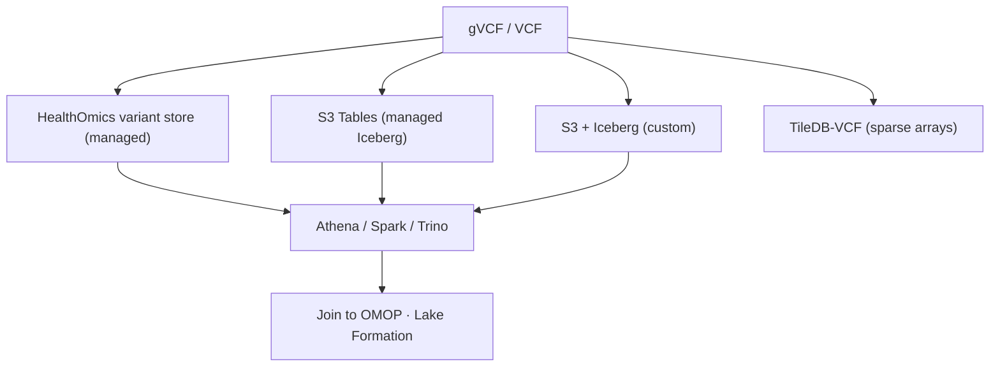

# Architecture: genomic variant store on AWS

## Problem

Store called variants for a growing cohort so that cross-sample questions (allele frequency,
carriers, gene roll-ups) are fast and cheap, new samples can be added incrementally (the
**N+1 problem**), and the data can be joined to clinical phenotypes — all under PHI-grade
governance.

## Forces / NFRs

- **Cross-sample query performance** at population scale (columnar pruning, partitioning).
- **Incremental ingest**: adding sample N+1 must not reprocess all N.
- **Joinability** to clinical (OMOP) data without data movement.
- **Governance**: genomic data is inherently re-identifying — high-sensitivity PHI.
- **Cost**: compute-dominated; minimize scan and egress.

## Options evaluated

- **HealthOmics variant store** — managed ingest + Athena query + provenance; least ops, AWS-native.
- **S3 Tables** — managed Apache Iceberg (auto compaction/maintenance); open format, low ops.
- **S3 + Iceberg (custom)** — full control of partitioning/engines; most work.
- **TileDB-VCF** — sparse-array store optimized for dense cohort queries and incremental ingest.

## Decision (reference)

Default to **HealthOmics variant store** for an all-AWS managed build with provenance; use
**S3 Tables** when you want open Iceberg + SQL with minimal table operations; drop to
**custom S3 + Iceberg** only when you need bespoke partitioning or multi-engine/multi-cloud
portability; choose **TileDB-VCF** when array-style cohort access dominates.

## Trade-offs recorded

- **Managed vs control:** HealthOmics/S3 Tables minimize ops and small-file pain; custom
  Iceberg maximizes control but you own compaction, snapshot expiry, and partitioning.
- **Partitioning:** by chromosome (+ sample batch) to prune cohort scans; right-size Parquet.
- **N+1:** gVCF + append/merge (Iceberg upsert or HealthOmics import) so new samples are additive.
- **Format lock-in:** Iceberg (S3 Tables or custom) keeps the store open and portable;
  HealthOmics trades some openness for managed provenance.

## Governance

Lake Formation column/row access control over the variant tables; KMS encryption; audited
access. Genomic data cannot be meaningfully de-identified — restrict and log access tightly.

## What to extend

- Add an annotation join (ClinVar-style, synthetic) and a gene-level roll-up view.
- Add a cost/latency benchmark harness across the four strategies.
- Wire ingest to a [HealthOmics](https://github.com/anothernoise/hls-sa) secondary-analysis workflow.
