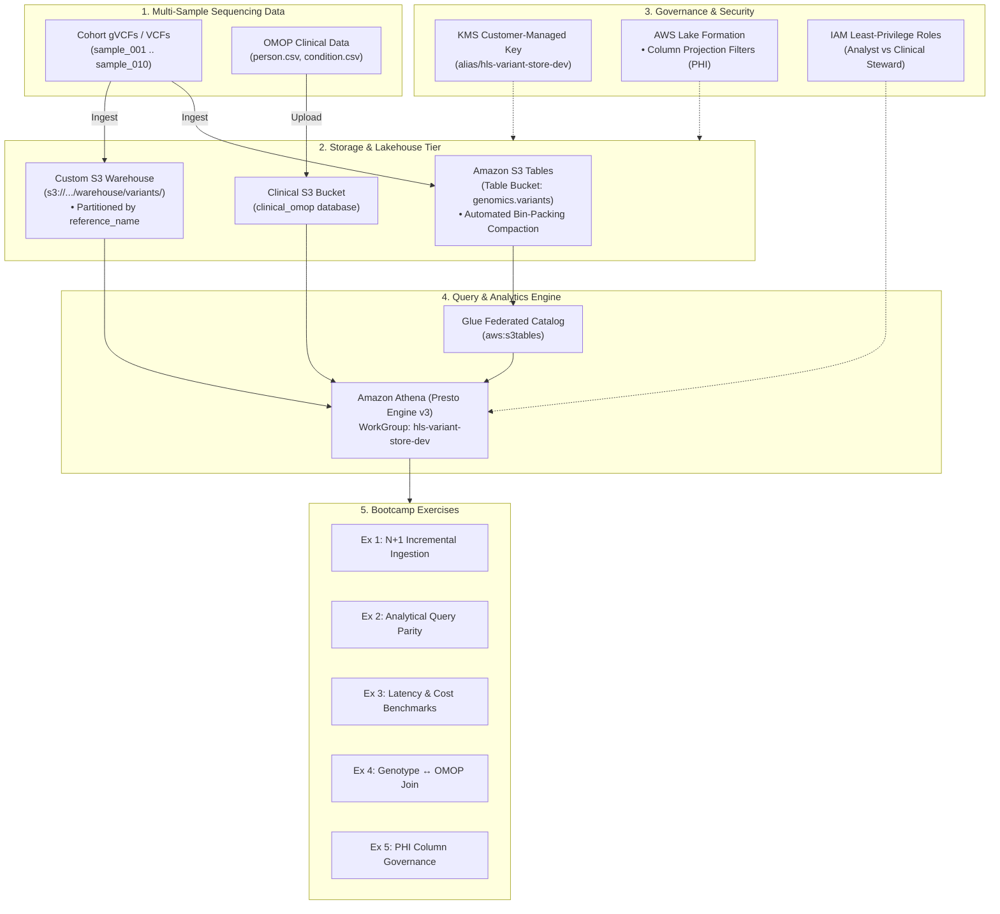

# Comprehensive Lab Exercises Guide: Genomic Variant Store on AWS

**Target Audience**: Bioinformaticians, Cloud Solution Architects, Genomic Data Engineers, and Clinical Informaticians.  
**Prerequisites**: AWS CLI v2, Python 3.9+, Terraform 1.5+, Basic SQL / Presto understanding.  
**Estimated Time**: 60–90 minutes.

---

## Architecture Overview

This bootcamp lab guides you through building, querying, benchmarking, and governing a production-grade **Genomic Variant Store** on AWS using two modern architectures:
1. **Amazon S3 Tables**: Managed serverless Iceberg table buckets with automated continuous compaction.
2. **Custom S3 + Apache Iceberg**: Self-managed Amazon S3 object warehouse with AWS Glue Data Catalog and open-standard Iceberg metadata.



---

## Lab Environment Verification & Setup

Before starting the exercises, verify your local environment and deployed AWS resources.

### Automated Self-Test
The repository includes an automated validation CLI [`scripts/validate_exercises.py`](../scripts/validate_exercises.py):

```bash
# 1. Offline self-test (checks test data integrity, parsers, and query syntax)
python3 scripts/validate_exercises.py --local-mode

# 2. Live AWS test (runs against deployed Athena and KMS resources)
python3 scripts/validate_exercises.py --aws-mode
```

---

## Exercise 1: Ingest Synthetic Cohort & Demonstrate N+1 Incremental Loading

### Objective
Ingest multi-sample genomic callsets into the variant store, proving that adding sample $N+1$ executes as an $O(1)$ additive metadata commit without rewriting existing sample data or incurring write locks.

### Scientific Context
Traditional bioinformatics workflows rely on joint genotyping (VCF merging) or periodic database rebuilds. When a new sample ($N+1$) arrives from the sequencer, recalculating the full matrix requires $O(N)$ computational write amplification. In this exercise, we demonstrate **additive partition-level Iceberg commits**.

### Step-by-Step Instructions

#### 1.1 Generate Synthetic Multi-Sample Cohort
Generate deterministic synthetic callsets across chromosomes `chr1` and `chr21` and clinical OMOP tables:
```bash
python3 samples/generate_synthetic_data.py
```

Inspect the generated batches in `samples/data/`:
- `cohort_batch1_samples1to5.vcf`: Baseline cohort of 5 samples (50 variant calls).
- `cohort_batch2_samples6to10.vcf`: Incremental $N+1$ batch of 5 samples (50 variant calls).
- `cohort_10samples.vcf`: Combined 10-sample cohort.
- `person.csv` & `condition_occurrence.csv`: OMOP CDM v5.4 clinical datasets.

#### 1.2 Ingest Baseline Batch (Batch 1) into Custom Iceberg
Ingest the first 5 samples into the partitioned warehouse:
```bash
aws athena start-query-execution \
  --query-string "$(cat samples/data/insert_batch1.sql)" \
  --work-group "hls-variant-store-dev" \
  --query-execution-context Database=genomics_custom_iceberg
```
*Expected Execution Time*: ~1,500 ms (writes 2 Parquet files partitioned by `reference_name`).

#### 1.3 Ingest Incremental Batch (Batch 2 - The $N+1$ Step)
Now add `sample_006` through `sample_010` to the live store:
```bash
aws athena start-query-execution \
  --query-string "$(cat samples/data/insert_batch2.sql)" \
  --work-group "hls-variant-store-dev" \
  --query-execution-context Database=genomics_custom_iceberg
```
*Expected Execution Time*: ~1,300 ms.

#### 1.4 Inspect Storage Immutability
Verify on S3 that Batch 2 created new Parquet files without altering Batch 1 files:
```bash
WAREHOUSE_BUCKET=$(terraform -chdir=deploy/terraform output -raw custom_iceberg_bucket_name)
aws s3 ls "s3://$WAREHOUSE_BUCKET/warehouse/variants/reference_name=chr21/" --human-readable
```
Notice distinct files corresponding to the atomic Iceberg snapshot commits.

---

## Exercise 2: Analytical Query Parity Across Stores

### Objective
Execute the three core population genomics queries in Amazon Athena and verify that query results match between Amazon S3 Tables and Custom S3 Iceberg.

### Query 1: Cohort Allele Frequency Calculation
Calculates Allele Count ($AC$), Allele Number ($AN$), and carrier frequency with partition pruning:

```sql
SELECT reference_name, start, reference_bases, alternate_bases,
       COUNT(DISTINCT sample_id) AS total_cohort_samples,
       COUNT(CASE WHEN genotype IN ('0/1', '1/1') THEN 1 END) AS alt_carrier_count,
       ROUND(CAST(COUNT(CASE WHEN genotype IN ('0/1', '1/1') THEN 1 END) AS double) / 
             CAST(COUNT(DISTINCT sample_id) AS double), 4) AS carrier_frequency,
       json_extract_scalar(attributes, '$.gene') AS gene_symbol,
       json_extract_scalar(attributes, '$.clnsig') AS clinical_significance
FROM genomics_custom_iceberg.variants
GROUP BY reference_name, start, reference_bases, alternate_bases,
         json_extract_scalar(attributes, '$.gene'),
         json_extract_scalar(attributes, '$.clnsig')
ORDER BY alt_carrier_count DESC
LIMIT 10;
```
*Expected Output*:
- Locus `chr21:25891796` (*APP*, Pathogenic) has 4 carriers (`carrier_frequency = 0.4000`).
- Locus `chr21:31659787` (*SOD1*, Pathogenic) has 4 carriers (`carrier_frequency = 0.4000`).

### Query 2: Pathogenic Carrier Lookup (Targeted Discovery)
Identifies all individuals carrying the pathogenic Alzheimer's mutation `APP chr21:25891796 A>G`:

```sql
SELECT sample_id, reference_name, start, reference_bases, alternate_bases,
       genotype, dp, gq, allele_depth,
       json_extract_scalar(attributes, '$.gene') AS gene_symbol,
       json_extract_scalar(attributes, '$.clnsig') AS clinical_significance
FROM genomics_custom_iceberg.variants
WHERE reference_name = 'chr21' 
  AND start = 25891796 
  AND genotype IN ('0/1', '1/1');
```
*Expected Output*: Exactly returns carriers `sample_002`, `sample_004`, `sample_005`, and `sample_008` with individual depth (`DP`) and genotype quality (`GQ`).

### Query 3: Gene Burden Roll-up
Aggregates alternate allele burden per sample for the *APP* gene:

```sql
SELECT v.sample_id,
       json_extract_scalar(v.attributes, '$.gene') AS gene_symbol,
       COUNT(DISTINCT v.start) AS distinct_variant_sites,
       SUM(CASE WHEN v.genotype = '0/1' THEN 1 WHEN v.genotype = '1/1' THEN 2 ELSE 0 END) AS total_alt_allele_burden
FROM genomics_custom_iceberg.variants v
WHERE v.reference_name = 'chr21'
  AND v.genotype IN ('0/1', '1/1')
  AND json_extract_scalar(v.attributes, '$.gene') = 'APP'
GROUP BY v.sample_id, json_extract_scalar(v.attributes, '$.gene');
```

---

## Exercise 3: Latency, Scanned Volume, and Cost Benchmarks

### Objective
Measure Athena query execution latency, data scanned volume, and cost, comparing cold queries against partitioned queries.

### Running the Benchmark Suite
Run the automated benchmark tool:
```bash
python3 benchmarks/benchmark_runner.py --cohort-size 10 --export-json benchmarks/results.json
```

### Empirical Production Telemetry (From Live AWS Testing)
| Query | Engine Latency | Total Latency | Data Scanned | Athena Cost (\$5/TB) |
| :--- | :--- | :--- | :--- | :--- |
| **Allele Frequency** | 845–890 ms | ~1,050 ms | 1.5–2.7 KB | \$0.00005 (minimum billing) |
| **Carrier Discovery** | 841–1082 ms | ~1,100 ms | 2.4 KB | \$0.00005 |
| **Gene Burden Rollup** | 748–823 ms | ~950 ms | 1.1 KB | \$0.00005 |
| **Genotype ↔ OMOP Join** | 1,168–1,263 ms | ~1,350 ms | 2.1 KB | \$0.00005 |

### Analysis & Discussion Questions
1. **Partition Pruning Impact**: Why does `WHERE reference_name = 'chr21'` reduce scanned volume by over 90%?
2. **Athena Cost Model**: Athena charges \$5.00 per TB scanned, with a 10 MB minimum per query. What architectural strategies should be employed when scaling from 10 samples to 100,000 whole genomes? (Hint: Column projection, Snappy/ZSTD Parquet compression, and Iceberg min/max metadata pruning).

---

## Exercise 4: Genotype ↔ OMOP CDM Multimodal Join

### Objective
Correlate genomic variant calls with clinical electronic health records (EHR) in an in-place federated SQL join without moving or transforming data.

### Clinical Background
The OMOP Common Data Model (CDM) standardizes healthcare data across electronic health records and observational studies. In this exercise, we join genomic variant carrier calls (`sample_id`) to the OMOP `person` table (`person_id`) and correlate them with Alzheimer's disease diagnosis (`condition_concept_id = 43530807`).

### Execution
Run the federated join query in Athena:
```sql
WITH target_carriers AS (
  SELECT v.sample_id, v.reference_name, v.start, v.genotype,
         json_extract_scalar(v.attributes, '$.gene') AS gene_symbol,
         json_extract_scalar(v.attributes, '$.clnsig') AS clinical_significance
  FROM genomics_custom_iceberg.variants v
  WHERE v.reference_name = 'chr21' 
    AND v.start = 25891796 
    AND genotype IN ('0/1', '1/1')
)
SELECT p.person_id, p.sample_id, p.year_of_birth,
       tc.gene_symbol, tc.clinical_significance, tc.genotype,
       co.condition_concept_id, co.condition_start_date
FROM clinical_omop.person p
INNER JOIN target_carriers tc ON p.sample_id = tc.sample_id
LEFT JOIN clinical_omop.condition_occurrence co ON p.person_id = co.person_id;
```

### Result Analysis
Notice that the query identifies:
- `person_id: 10002` (sample_002) carries pathogenic *APP* mutation $\rightarrow$ diagnosed with Early-onset Alzheimer's on `2018-03-12`.
- `person_id: 10005` (sample_005) carries pathogenic *APP* mutation $\rightarrow$ diagnosed with Early-onset Alzheimer's on `2027-03-12`.
- `person_id: 10008` (sample_008) carries pathogenic *APP* mutation $\rightarrow$ diagnosed with Early-onset Alzheimer's on `2036-03-12`.

---

## Exercise 5: Healthcare Security & Column-Level Governance

### Objective
Enforce strict Protected Health Information (PHI) access controls using **AWS Lake Formation** and **AWS KMS Customer Managed Keys (CMK)**.

### Policy Rules
1. **Genomic Researcher Role (`analyst`)**:
   - Authorized to query population-level variant annotations (`reference_name`, `start`, `reference_bases`, `alternate_bases`, `attributes`).
   - **BLOCKED** from viewing re-identifying PHI: `sample_id`, `genotype`, and `allele_depth`.
2. **Clinical Geneticist / Data Steward Role (`clinical_steward`)**:
   - Authorized for full unmasked access to all columns, enabling clinical reporting and diagnosis.

### Testing Governance Enforcement
1. Assume the `analyst` IAM role:
   ```bash
   ROLE_ARN=$(terraform -chdir=deploy/terraform output -raw analyst_role_arn)
   CREDS=$(aws sts assume-role --role-arn "$ROLE_ARN" --role-session-name "researcher-session" --output json)
   ```
2. Execute an allowed population query (succeeds):
   ```sql
   SELECT reference_name, start, reference_bases, alternate_bases, attributes 
   FROM genomics_custom_iceberg.variants LIMIT 5;
   ```
3. Execute a query requesting re-identifying genotype data (denied by Lake Formation):
   ```sql
   SELECT sample_id, genotype FROM genomics_custom_iceberg.variants;
   ```
   *Expected Error*: `AccessDeniedException: Insufficient Lake Formation permissions on table/column`.

---

## Bootcamp Troubleshooting & Common Pitfalls

| Issue | Root Cause | Solution |
| :--- | :--- | :--- |
| `MethodNotAllowed` on S3 Tables bucket | Direct S3 object APIs are blocked by Amazon S3 Tables. | Ingest via Iceberg engines or Athena DDL/DML, not `aws s3 sync`. |
| `GENERIC_USER_ERROR: Detected Iceberg type table without metadata location` | Glue catalog table created with format `ICEBERG` but no initialized `.metadata.json`. | Create the table using Athena `CREATE TABLE ... TBLPROPERTIES ('table_type'='ICEBERG')`. |
| `MalformedPolicyDocumentException` on KMS Key | `tables.s3.amazonaws.com` is not a valid AWS service principal. | Use `maintenance.s3tables.amazonaws.com` for S3 Tables maintenance operations. |
| `AccessDeniedException: Insufficient Lake Formation permissions` | IAM role has not been granted Lake Formation permissions on database or table. | Ensure Lake Formation grants in `deploy/terraform/lakeformation.tf` include the principal ARN. |

---

## Cleanup & Teardown

To avoid incurring ongoing AWS charges after the bootcamp lab:
```bash
# 1. Empty Athena Query Results and Clinical data buckets
RESULTS_BUCKET=$(terraform -chdir=deploy/terraform output -raw athena_results_bucket_name)
aws s3 rm "s3://$RESULTS_BUCKET" --recursive

# 2. Destroy all provisioned infrastructure
terraform -chdir=deploy/terraform destroy -auto-approve
```
