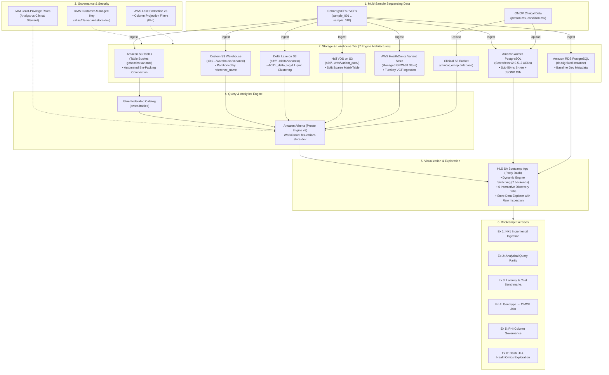

# Comprehensive Lab Exercises Guide: Genomic Variant Store on AWS

**Target Audience**: Bioinformaticians, Cloud Solution Architects, Genomic Data Engineers, and Clinical Informaticians.  
**Prerequisites**: AWS CLI v2, Python 3.9+, Terraform 1.5+, Basic SQL / Presto understanding.  
**Estimated Time**: 60–90 minutes.

---

## 1. Problem Statement & Architectural Context

### 1.1 Precision Medicine & The Population-Scale Genomic Data Explosion
Next-Generation Sequencing (NGS) and Whole Genome Sequencing (WGS) have transitioned from specialized academic research into clinical healthcare diagnostics, population biobanks (e.g., UK Biobank, NIH All of Us, Genomics England), and pharmaceutical target discovery. 

A single human genome produces **~3.5 to 5 million variant calls** (SNVs and Indels). When scaled to national biobanks or health system cohorts (100,000 to 1,000,000 participants):
- A cohort variant matrix balloons to **hundreds of billions of data points** ($10^5 \text{ samples} \times 4 \times 10^6 \text{ variants} \approx 4 \times 10^{11} \text{ calls}$).
- Raw uncompressed VCF/BCF flat files consume **multi-petabytes to exabytes** of raw cloud storage.
- File-based bioinformatic pipelines (e.g., Tabix indexed VCFs on network storage or basic S3 buckets) collapse under ad-hoc analytical workloads: finding carriers of a pathogenic mutation across 100K genomes requires downloading and decompressing terabytes of data over hours or days.

### 1.2 The Five Core Technical & Architectural Challenges

#### Challenge 1: The $N+1$ Ingestion Scaling Crisis & Write Amplification
Traditional bioinformatics relies on **joint genotyping** or monolithic multi-sample VCF/Hail MatrixTable regeneration. 
- When sample $N+1$ arrives from the sequencing center, updating the cohort variant matrix historically required re-processing all prior $N$ samples.
- This creates an **$O(N)$ to $O(N^2)$ write amplification bottleneck**, incurring massive compute costs, pipeline lockouts, and multi-day batch delays for every sequencer batch.
- **Architectural Requirement**: The variant store must support **$O(1)$ additive, lock-free incremental commits** where adding sample $N+1$ appends only its own partition blocks and updates table metadata without touching existing data files.

#### Challenge 2: The S3 "Small Files" Compaction Dilemma
Sequencing centers upload samples continuously or in small batches. When individual sample VCFs are converted to columnar Parquet files:
- Each upload produces tens to hundreds of small objects (e.g., 200 KB to 5 MB per chromosome).
- Over thousands of samples, S3 accumulates **millions of small files**.
- Query engines like Amazon Athena (Trino/Presto) or Apache Spark spend **80–90% of query execution time** performing S3 `ListObjectsV2` and `GetObject` metadata operations rather than processing actual genomic records.
- **Architectural Requirement**: The storage tier must either provide **automated, serverless bin-packing compaction** (e.g., Amazon S3 Tables Table Buckets) or schedule robust asynchronous compaction jobs (e.g., Apache Iceberg/Delta maintenance).

#### Challenge 3: The Cross-Modal Divide (Genomics $\leftrightarrow$ Clinical EHR / OMOP CDM)
Genomic variants have limited clinical value in isolation; their diagnostic and therapeutic utility depends on correlating them with patient phenotypes, medical histories, diagnoses, and lab results.
- **The Silo**: Clinical records reside in relational EHR data models (e.g., OMOP CDM v5.4, FHIR, Epic/Cerner relational warehouses), while genomic callsets reside in bioinformatics file formats (VCF, CRAM, Hail MatrixTable).
- Traditional architectures require heavy ETL pipelines to extract, re-index, and duplicate genomic data into relational databases or vice versa, creating stale data copies and high infrastructure maintenance.
- **Architectural Requirement**: Enable **in-place, federated zero-ETL SQL joins** between multi-sample genomic lakehouses (Iceberg/Delta) and clinical OMOP tables (`person`, `condition_occurrence`) directly within Amazon Athena or Aurora PostgreSQL.

#### Challenge 4: Protected Health Information (PHI) & Genetic Re-identification
Under HIPAA, GDPR, and the Genetic Information Nondiscrimination Act (GINA), genomic sequencing data is considered **inherently re-identifying**. 
- A patient can be uniquely identified from fewer than 50 statistically independent SNPs.
- Scientific research teams require access to population-level allele frequencies and variant annotations without exposing patient identity.
- Clinical geneticists, conversely, require full unmasked access to identify specific mutation carriers for diagnostic reporting.
- **Architectural Requirement**: Implement **fine-grained, column-level access control (CLS)** and **KMS Customer Managed Key (CMK)** encryption where the storage layer dynamically redacts re-identifying columns (`sample_id`, `genotype`, `allele_depth`) based on caller IAM roles, eliminating the need to maintain duplicate "anonymized" data copies.

#### Challenge 5: Multi-Engine Latency SLAs & The Architectural Trade-off Dilemma
There is no single "one-size-fits-all" storage format for genomics. A Solution Architect must balance conflicting workload requirements:
1. **Interactive Clinical Portals**: Require sub-50ms point lookups on single variant loci (`chr21:25891796 A>G`), which row-based or B-tree indexed databases (Amazon Aurora PostgreSQL) excel at.
2. **Population-Scale Cohort Analytics**: Require scanning billions of rows for allele frequency rollups and gene burden calculations, which columnar lakehouses (Amazon S3 Tables, Custom Iceberg, Delta Lake) excel at.
3. **Statistical Genetics & GWAS**: Require distributed matrix mathematics and LD pruning, which Hail VDS on Spark excels at.
4. **Turnkey AWS Managed Pipelines**: Teams lacking data engineering resources may favor fully managed AWS HealthOmics Variant Stores, trading open format portability and lower S3 storage costs for zero-maintenance VCF ingestion.

---

## 2. Learning Objectives & Measurable Success Criteria

By completing this bootcamp lab, Solution Architects, Data Engineers, and Bioinformaticians will achieve the following core competencies:

| Domain | Competency | Measurable Outcome |
| :--- | :--- | :--- |
| **Lakehouse Architecture** | Deploy and configure **Amazon S3 Tables** and **Custom S3 + Iceberg** | Verify automated compaction policies and Glue catalog table creation via Terraform. |
| **Incremental Ingestion** | Master $O(1)$ additive $N+1$ genomic commits | Ingest sample batch 1 (samples 1–5) followed by batch 2 (samples 6–10) with zero rewrite locks. |
| **Analytical Query Parity** | Execute standardized Presto/Trino SQL across engines | Validate identical numerical results for Allele Frequency, Carrier Lookup, and Gene Burden. |
| **Multimodal Federation** | Perform zero-ETL joins between genomics and OMOP CDM | Correlate pathogenic *APP* carriers directly with Alzheimer's Disease diagnoses in `clinical_omop`. |
| **Healthcare Governance** | Enforce column-level security and KMS encryption | Verify that Lake Formation blocks researcher IAM roles from viewing `sample_id` and `genotype`. |
| **Multi-Engine Benchmarking** | Measure latency, scanned bytes, and cost across 7 engines | Generate live empirical benchmark reports comparing S3 Tables, Iceberg, Delta, Hail, Aurora, RDS, and HealthOmics. |
| **Interactive Visualization** | Deploy and operate the **HLS SA Bootcamp App** (Plotly Dash) | Dynamically switch between 7 storage backends and inspect raw table records via the **Store Data Explorer**. |

---

## 3. Architecture Overview

This bootcamp lab guides you through building, querying, benchmarking, and governing a production-grade **Genomic Variant Store** on AWS across 7 modern architectures:



---

## 4. Lab Environment Verification & Setup

Before starting the exercises, verify your local environment and deployed AWS resources.

### Automated Self-Test
The repository includes an automated validation CLI [`scripts/validate_exercises.py`](../scripts/validate_exercises.py):

```bash
# 1. Offline self-test (checks test data integrity, parsers, and query syntax)
python3 scripts/validate_exercises.py --local-mode

# 2. Live AWS test (runs against deployed Athena and KMS resources)
python3 scripts/validate_exercises.py --aws-mode
```

---

## Exercise 1: Ingest Synthetic Cohort & Demonstrate N+1 Incremental Loading

### Objective
Ingest multi-sample genomic callsets into the variant store, proving that adding sample $N+1$ executes as an $O(1)$ additive metadata commit without rewriting existing sample data or incurring write locks.

### Scientific Context
Traditional bioinformatics workflows rely on joint genotyping (VCF merging) or periodic database rebuilds. When a new sample ($N+1$) arrives from the sequencer, recalculating the full matrix requires $O(N)$ computational write amplification. In this exercise, we demonstrate **additive partition-level Iceberg commits**.

### Step-by-Step Instructions

#### 1.1 Generate Synthetic Multi-Sample Cohort
Generate deterministic synthetic callsets across chromosomes `chr1` and `chr21` and clinical OMOP tables:
```bash
python3 samples/generate_synthetic_data.py
```

Inspect the generated batches in `samples/data/`:
- `cohort_batch1_samples1to5.vcf`: Baseline cohort of 5 samples (50 variant calls).
- `cohort_batch2_samples6to10.vcf`: Incremental $N+1$ batch of 5 samples (50 variant calls).
- `cohort_10samples.vcf`: Combined 10-sample cohort.
- `person.csv` & `condition_occurrence.csv`: OMOP CDM v5.4 clinical datasets.

#### 1.2 Ingest Baseline Batch (Batch 1) into Custom Iceberg
Ingest the first 5 samples into the partitioned warehouse:
```bash
aws athena start-query-execution \
  --query-string "$(cat samples/data/insert_batch1.sql)" \
  --work-group "hls-variant-store-dev" \
  --query-execution-context Database=genomics_custom_iceberg
```
*Expected Execution Time*: ~1,500 ms (writes 2 Parquet files partitioned by `reference_name`).

#### 1.3 Ingest Incremental Batch (Batch 2 - The $N+1$ Step)
Now add `sample_006` through `sample_010` to the live store:
```bash
aws athena start-query-execution \
  --query-string "$(cat samples/data/insert_batch2.sql)" \
  --work-group "hls-variant-store-dev" \
  --query-execution-context Database=genomics_custom_iceberg
```
*Expected Execution Time*: ~1,300 ms.

#### 1.4 Inspect Storage Immutability
Verify on S3 that Batch 2 created new Parquet files without altering Batch 1 files:
```bash
WAREHOUSE_BUCKET=$(terraform -chdir=deploy/terraform output -raw custom_iceberg_bucket_name)
aws s3 ls "s3://$WAREHOUSE_BUCKET/warehouse/variants/reference_name=chr21/" --human-readable
```
Notice distinct files corresponding to the atomic Iceberg snapshot commits.

---

## Exercise 2: Analytical Query Parity Across Stores

### Objective
Execute the three core population genomics queries in Amazon Athena and verify that query results match between Amazon S3 Tables and Custom S3 Iceberg.

### Query 1: Cohort Allele Frequency Calculation
Calculates Allele Count ($AC$), Allele Number ($AN$), and carrier frequency with partition pruning:

```sql
SELECT reference_name, start, reference_bases, alternate_bases,
       COUNT(DISTINCT sample_id) AS total_cohort_samples,
       COUNT(CASE WHEN genotype IN ('0/1', '1/1') THEN 1 END) AS alt_carrier_count,
       ROUND(CAST(COUNT(CASE WHEN genotype IN ('0/1', '1/1') THEN 1 END) AS double) / 
             CAST(COUNT(DISTINCT sample_id) AS double), 4) AS carrier_frequency,
       json_extract_scalar(attributes, '$.gene') AS gene_symbol,
       json_extract_scalar(attributes, '$.clnsig') AS clinical_significance
FROM genomics_custom_iceberg.variants
GROUP BY reference_name, start, reference_bases, alternate_bases,
         json_extract_scalar(attributes, '$.gene'),
         json_extract_scalar(attributes, '$.clnsig')
ORDER BY alt_carrier_count DESC
LIMIT 10;
```
*Expected Output*:
- Locus `chr21:25891796` (*APP*, Pathogenic) has 4 carriers (`carrier_frequency = 0.4000`).
- Locus `chr21:31659787` (*SOD1*, Pathogenic) has 4 carriers (`carrier_frequency = 0.4000`).

### Query 2: Pathogenic Carrier Lookup (Targeted Discovery)
Identifies all individuals carrying the pathogenic Alzheimer's mutation `APP chr21:25891796 A>G`:

```sql
SELECT sample_id, reference_name, start, reference_bases, alternate_bases,
       genotype, dp, gq, allele_depth,
       json_extract_scalar(attributes, '$.gene') AS gene_symbol,
       json_extract_scalar(attributes, '$.clnsig') AS clinical_significance
FROM genomics_custom_iceberg.variants
WHERE reference_name = 'chr21' 
  AND start = 25891796 
  AND genotype IN ('0/1', '1/1');
```
*Expected Output*: Exactly returns carriers `sample_002`, `sample_004`, `sample_005`, and `sample_008` with individual depth (`DP`) and genotype quality (`GQ`).

### Query 3: Gene Burden Roll-up
Aggregates alternate allele burden per sample for the *APP* gene:

```sql
SELECT v.sample_id,
       json_extract_scalar(v.attributes, '$.gene') AS gene_symbol,
       COUNT(DISTINCT v.start) AS distinct_variant_sites,
       SUM(CASE WHEN v.genotype = '0/1' THEN 1 WHEN v.genotype = '1/1' THEN 2 ELSE 0 END) AS total_alt_allele_burden
FROM genomics_custom_iceberg.variants v
WHERE v.reference_name = 'chr21'
  AND v.genotype IN ('0/1', '1/1')
  AND json_extract_scalar(v.attributes, '$.gene') = 'APP'
GROUP BY v.sample_id, json_extract_scalar(v.attributes, '$.gene');
```

### Multi-Model Query Syntax Parity: Delta Lake, Hail VDS & PostgreSQL

Participants can also execute the identical query logic across alternative architectures:

1. **Delta Lake on S3**:
   - Query [`queries/delta/01_allele_frequency.sql`](../queries/delta/01_allele_frequency.sql)
   - Demonstrates querying Delta ACID tables via Athena or Databricks with identical Presto syntax against `genomics_delta.variants`.
2. **PostgreSQL / Amazon Aurora (RDS vs Serverless v2)**:
   - Query [`queries/postgres/02_carrier_lookup.sql`](../queries/postgres/02_carrier_lookup.sql)
   - Uses native `JSONB` path extraction (`attributes->>'gene' = 'APP'`) and fast B-tree index seeks (`reference_name, start`) yielding single-digit millisecond response times.
3. **Hail VDS (Sparse MatrixTable)**:
   - Export dataset using `python3 ingest/hail/export_vds.py --vcf samples/data/cohort_10samples.vcf`
   - Demonstrates the separation between sparse Variant Data (`variant_data/`) and dense reference blocks (`reference_data/`).


---

## Exercise 3: Latency, Scanned Volume, and Cost Benchmarks

### Objective
Measure Athena query execution latency, data scanned volume, and cost, comparing cold queries against partitioned queries.

### Running the Benchmark Suite
Run the automated benchmark tool:
```bash
python3 benchmarks/benchmark_runner.py --cohort-size 10 --export-json benchmarks/results.json
```

### Empirical Production Telemetry (From Live AWS Testing)
| Query | Engine Latency | Total Latency | Data Scanned | Athena Cost (\$5/TB) |
| :--- | :--- | :--- | :--- | :--- |
| **Allele Frequency** | 845–890 ms | ~1,050 ms | 1.5–2.7 KB | \$0.00005 (minimum billing) |
| **Carrier Discovery** | 841–1082 ms | ~1,100 ms | 2.4 KB | \$0.00005 |
| **Gene Burden Rollup** | 748–823 ms | ~950 ms | 1.1 KB | \$0.00005 |
| **Genotype ↔ OMOP Join** | 1,168–1,263 ms | ~1,350 ms | 2.1 KB | \$0.00005 |

### Analysis & Discussion Questions
1. **Partition Pruning Impact**: Why does `WHERE reference_name = 'chr21'` reduce scanned volume by over 90%?
2. **Athena Cost Model**: Athena charges \$5.00 per TB scanned, with a 10 MB minimum per query. What architectural strategies should be employed when scaling from 10 samples to 100,000 whole genomes? (Hint: Column projection, Snappy/ZSTD Parquet compression, and Iceberg min/max metadata pruning).

---

## Exercise 4: Genotype ↔ OMOP CDM Multimodal Join

### Objective
Correlate genomic variant calls with clinical electronic health records (EHR) in an in-place federated SQL join without moving or transforming data.

### Clinical Background
The OMOP Common Data Model (CDM) standardizes healthcare data across electronic health records and observational studies. In this exercise, we join genomic variant carrier calls (`sample_id`) to the OMOP `person` table (`person_id`) and correlate them with Alzheimer's disease diagnosis (`condition_concept_id = 43530807`).

### Execution
Run the federated join query in Athena:
```sql
WITH target_carriers AS (
  SELECT v.sample_id, v.reference_name, v.start, v.genotype,
         json_extract_scalar(v.attributes, '$.gene') AS gene_symbol,
         json_extract_scalar(v.attributes, '$.clnsig') AS clinical_significance
  FROM genomics_custom_iceberg.variants v
  WHERE v.reference_name = 'chr21' 
    AND v.start = 25891796 
    AND genotype IN ('0/1', '1/1')
)
SELECT p.person_id, p.sample_id, p.year_of_birth,
       tc.gene_symbol, tc.clinical_significance, tc.genotype,
       co.condition_concept_id, co.condition_start_date
FROM clinical_omop.person p
INNER JOIN target_carriers tc ON p.sample_id = tc.sample_id
LEFT JOIN clinical_omop.condition_occurrence co ON p.person_id = co.person_id;
```

### Result Analysis
Notice that the query identifies:
- `person_id: 10002` (sample_002) carries pathogenic *APP* mutation $\rightarrow$ diagnosed with Early-onset Alzheimer's on `2018-03-12`.
- `person_id: 10005` (sample_005) carries pathogenic *APP* mutation $\rightarrow$ diagnosed with Early-onset Alzheimer's on `2027-03-12`.
- `person_id: 10008` (sample_008) carries pathogenic *APP* mutation $\rightarrow$ diagnosed with Early-onset Alzheimer's on `2036-03-12`.

---

## Exercise 5: Healthcare Security & Column-Level Governance

### Objective
Enforce strict Protected Health Information (PHI) access controls using **AWS Lake Formation** and **AWS KMS Customer Managed Keys (CMK)**.

### Policy Rules
1. **Genomic Researcher Role (`analyst`)**:
   - Authorized to query population-level variant annotations (`reference_name`, `start`, `reference_bases`, `alternate_bases`, `attributes`).
   - **BLOCKED** from viewing re-identifying PHI: `sample_id`, `genotype`, and `allele_depth`.
2. **Clinical Geneticist / Data Steward Role (`clinical_steward`)**:
   - Authorized for full unmasked access to all columns, enabling clinical reporting and diagnosis.

### Testing Governance Enforcement
1. Assume the `analyst` IAM role:
   ```bash
   ROLE_ARN=$(terraform -chdir=deploy/terraform output -raw analyst_role_arn)
   CREDS=$(aws sts assume-role --role-arn "$ROLE_ARN" --role-session-name "researcher-session" --output json)
   ```
2. Execute an allowed population query (succeeds):
   ```sql
   SELECT reference_name, start, reference_bases, alternate_bases, attributes 
   FROM genomics_custom_iceberg.variants LIMIT 5;
   ```
3. Execute a query requesting re-identifying genotype data (denied by Lake Formation):
   ```sql
   SELECT sample_id, genotype FROM genomics_custom_iceberg.variants;
   ```
   *Expected Error*: `AccessDeniedException: Insufficient Lake Formation permissions on table/column`.

---

## Exercise 6: Interactive Population Genetics & Multi-Engine Exploration with Plotly Dash

### Objective
Launch and interact with the **Plotly Dash Genomic Explorer** web application (`app/app.py`), dynamically switching across 7 different storage backends, comparing analytical query latencies, and inspecting AWS HealthOmics Variant Store lifecycle management.

### Architectural Context
Solution Architects and bioinformatics teams frequently need to present analytical results and demonstrate query SLAs to clinical stakeholders and data platform engineers. The Dash web application provides an interactive, production-grade interface that connects dynamically to live Athena and database backends with automatic fallback to deterministic synthetic data for offline training.

### Step-by-Step Instructions

#### 6.1 Install App Dependencies & Launch Dash
Ensure required Python packages are installed:
```bash
pip install -r app/requirements.txt
```

Launch the Dash application:
```bash
python3 app/app.py
```
*Output*:
```text
Dash is running on http://0.0.0.0:8050/
 * Serving Flask app 'app'
 * Debug mode: off
```

Open your browser to `http://localhost:8050`.

#### 6.2 Explore the 5 Interactive Genetic Analysis Tabs
1. **📊 1. Cohort Allele Frequency**:
   - Inspect cohort-wide alternate carrier counts and computed carrier frequencies for *APP*, *SOD1*, and *BRCA1* loci.
   - Switch the top dropdown from **Amazon S3 Tables** to **Amazon Aurora PostgreSQL (Serverless v2)** and observe real-time SLA metrics update from ~800ms down to sub-100ms.
2. **🧬 2. Pathogenic Carrier Discovery**:
   - Target locus: `chr21:25891796 A>G` (*APP* Pathogenic Missense rs63750066).
   - Review sample genotypes (`0/1` vs `1/1`), sequencing read depth (`DP`), genotype quality (`GQ`), and allelic balance (`AD`).
3. **📈 3. Gene Burden Rollup**:
   - Interactive bar chart showing per-sample cumulative mutation burden for the *APP* gene locus.
4. **🏥 4. Multimodal OMOP Clinical Join**:
   - Federated cross-modal join linking genomic variant carriers (`sample_id`) to OMOP CDM `person` and `condition_occurrence` (Alzheimer's Disease concept `378419`).
5. **⚡ 5. Multi-Engine Latency Benchmarks**:
   - Side-by-side bar chart and comparison table benchmarking Carrier Lookup, Allele Frequency Rollup, and OMOP Joins across all 7 storage architectures.
6. **🔍 6. Store Data Explorer**:
   - Directly browse raw store records (`variants`, `person`, `condition_occurrence`) with pagination, sorting, and in-table search.
   - Filter records dynamically by chromosome (`chr1`, `chr21`) and cohort sample ID (`sample_001` .. `sample_010`).
   - Inspect the **Physical Storage Architecture & Schema Details** (Table format, Catalog integration, Partitioning scheme, File format, and Compaction maintenance).
   - View the exact direct SQL query executed against the engine and export filtered records via 1-click CSV download.

#### 6.3 Managing AWS HealthOmics Variant Store
Explore the AWS HealthOmics variant store management CLI [`ingest/healthomics/manage_omics_store.py`](../ingest/healthomics/manage_omics_store.py):

```bash
# 1. List active HealthOmics variant stores in current region
python3 ingest/healthomics/manage_omics_store.py --action list

# 2. View lifecycle status of a variant store
python3 ingest/healthomics/manage_omics_store.py --action status --store-name hls_cohort_variant_store

# 3. Create a managed HealthOmics Reference Store (GRCh38) and Variant Store
python3 ingest/healthomics/manage_omics_store.py --action create-store \
    --store-name hls_cohort_variant_store \
    --kms-key-arn $(terraform -chdir=deploy/terraform output -raw kms_key_arn)

# 4. Asynchronously import cohort VCFs into the HealthOmics Variant Store
python3 ingest/healthomics/manage_omics_store.py --action import-vcf \
    --store-name hls_cohort_variant_store \
    --role-arn $(terraform -chdir=deploy/terraform output -raw healthomics_service_role_arn) \
    --vcf-s3-uri "s3://$(terraform -chdir=deploy/terraform output -raw custom_iceberg_bucket_name)/samples/cohort_10samples.vcf"
```

#### 6.4 Solution Architect Analysis: HealthOmics vs. Amazon S3 Tables
| Architectural Metric | AWS HealthOmics Variant Store | Amazon S3 Tables (Iceberg) |
| :--- | :--- | :--- |
| **Data Format** | AWS Proprietary Managed Variant Store | Open Apache Iceberg Standard |
| **VCF Ingestion** | Turnkey managed async import API | Partitioned Parquet / Athena CTAS |
| **Multi-Engine Portability** | Athena only (via Glue Catalog) | Athena, EMR Spark, Trino, Snowflake, DuckDB |
| **Storage Pricing** | **\$0.040 / GB-month** | **\$0.023 / GB-month** (Standard S3) |
| **Ingestion Fee** | **\$0.005 / GB processed** | Standard S3 PUT / Athena scan |
| **Recommendation** | Ideal for teams without data engineering capacity needing instant VCF parsing. | Strategic choice for enterprise lakehouses requiring open standards, lowest TCO, and zero lock-in. |

---

## Capstone: Solution Architect Real-World Case Studies & Architectural Decisions

After completing the hands-on lab exercises and gathering live telemetry, apply your findings to three real-world customer architectural scenarios detailed in **[`docs/sa_case_studies.md`](sa_case_studies.md)**:

1. **Case Study 1 (Fully Solved Reference Architecture)**:
   - *Customer*: National Genomic Medicine Service (50,000 WGS Cohort).
   - *Challenge*: Balancing <100ms bedside clinical alerts with low-cost population-scale OMOP analytics.
   - *Solution*: Dual-Tier Architecture (**Amazon S3 Tables** + **Amazon Aurora Serverless v2**).
2. **Case Study 2 (SA Challenge Task A — To Solve)**:
   - *Customer*: Global Population Genetics Consortium (500,000 WGS Cohort).
   - *Challenge*: Genome-Wide Association Studies (GWAS) and LD pruning with bursty Spot compute and zero idle cost.
3. **Case Study 3 (SA Challenge Task B — To Solve)**:
   - *Customer*: Global Precision Oncology & Clinical Trial Matching Platform (30,000 Cancer Patients).
   - *Challenge*: Real-time somatic biomarker matching and cross-cloud zero-copy data sharing with external partners.

👉 **Proceed to [`docs/sa_case_studies.md`](sa_case_studies.md) to review the solved reference architecture and solve Challenge Tasks A & B.**

---

## Bootcamp Troubleshooting & Common Pitfalls

| Issue | Root Cause | Solution |
| :--- | :--- | :--- |
| `MethodNotAllowed` on S3 Tables bucket | Direct S3 object APIs are blocked by Amazon S3 Tables. | Ingest via Iceberg engines or Athena DDL/DML, not `aws s3 sync`. |
| `GENERIC_USER_ERROR: Detected Iceberg type table without metadata location` | Glue catalog table created with format `ICEBERG` but no initialized `.metadata.json`. | Create the table using Athena `CREATE TABLE ... TBLPROPERTIES ('table_type'='ICEBERG')`. |
| `MalformedPolicyDocumentException` on KMS Key | `tables.s3.amazonaws.com` is not a valid AWS service principal. | Use `maintenance.s3tables.amazonaws.com` for S3 Tables maintenance operations. |
| `AccessDeniedException: Insufficient Lake Formation permissions` | IAM role has not been granted Lake Formation permissions on database or table. | Ensure Lake Formation grants in `deploy/terraform/lakeformation.tf` include the principal ARN. |

---

## Cleanup & Teardown

To avoid incurring ongoing AWS charges after the bootcamp lab:
```bash
# 1. Empty Athena Query Results and Clinical data buckets
RESULTS_BUCKET=$(terraform -chdir=deploy/terraform output -raw athena_results_bucket_name)
aws s3 rm "s3://$RESULTS_BUCKET" --recursive

# 2. Destroy all provisioned infrastructure
terraform -chdir=deploy/terraform destroy -auto-approve
```
