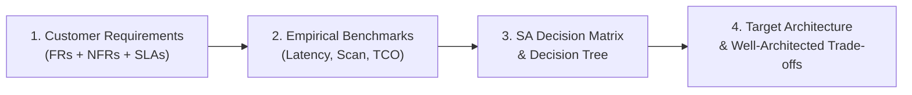
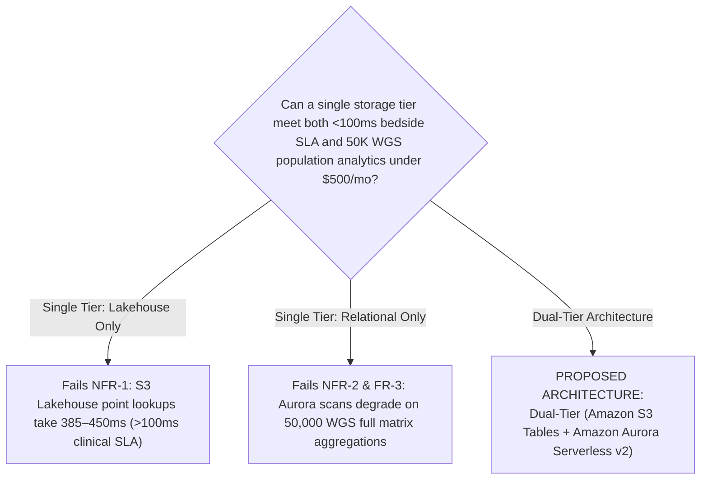

# Solution Architect Real-World Case Studies & Decision Framework

**Target Audience**: Solution Architects, Principal Data Engineers, and Enterprise Technology Leaders.  
**Purpose**: Apply the empirical performance benchmarks, the **Solution Architect Decision Matrix**, and the **Decision Tree** from [`docs/summary.md`](summary.md) to real-world healthcare and life sciences customer scenarios.

---

## The Solution Architect Evaluation Methodology

After executing the hands-on lab exercises (Exercises 1 through 6) and gathering empirical telemetry on **Query Latency**, **Bytes Scanned**, **Compaction Overhead**, and **Total Cost of Ownership (TCO)**, a Solution Architect must synthesize these results against customer requirements:



---

## Case Study 1 (Fully Solved Reference Example)

### Customer Profile: National Genomic Medicine Service
A national public health agency is transitioning Whole Genome Sequencing (WGS) into routine clinical care across 15 regional hospital networks.
- **Cohort Scale**: 50,000 whole genomes in year 1, scaling by 1,500 new patient genomes per month ($N+1$ continuous stream).
- **Target Phenotypes**: Paired with electronic health records (EHR) formatted in the **OMOP Common Data Model (v5.4)**.

### 1. Requirements

#### Functional Requirements (FRs)
- **FR-1 (Continuous Ingestion)**: Ingest incoming patient gVCF batches weekly without taking database offline or recomputing existing cohort matrices.
- **FR-2 (Bedside Clinical Alerts)**: Point lookup for actionable pathogenic variants (e.g. *APP* rs63750066, *BRCA1/2*, *CYP2C19* pharmacogenomics) for a single patient within clinical consultation sessions.
- **FR-3 (Population Cohort Analytics)**: Calculate cohort-wide allele frequencies, carrier counts, and gene burden rollups across the entire 50,000 patient matrix.
- **FR-4 (Cross-Modal Phenotype Federation)**: Perform zero-ETL joins between genomic variant calls and OMOP clinical diagnoses (e.g. linking *APP* missense carriers to Alzheimer's diagnoses).

#### Non-Functional Requirements (NFRs)
- **NFR-1 (Clinical Latency SLA)**: Bedside variant queries (FR-2) must return in **< 100 milliseconds** (P99).
- **NFR-2 (Analytical Query SLA)**: Population allele frequency rollups (FR-3) must return in **< 3 seconds**.
- **NFR-3 (Zero-Ops Compaction)**: Automated storage maintenance; the data engineering team cannot manage manual file bin-packing or Spark vacuum jobs.
- **NFR-4 (PHI & HIPAA Compliance)**: Strict column-level security. Academic researchers must query allele frequencies with `sample_id` and `genotype` completely redacted; clinical geneticists get unmasked access.
- **NFR-5 (Cost Ceiling)**: Storage and query costs must remain under **$500/month** at 50,000 genomes.

### 2. Empirical Performance & Cost Telemetry

Based on benchmarks from Exercise 3 and the live benchmark runner:

| Evaluated Architecture | Bedside Carrier Point Lookup (ms) | Population Allele Frequency (ms) | OMOP Phenotype Join (ms) | $N+1$ Small-File Compaction Ops | Monthly Storage & Query Cost (50K WGS) |
| :--- | :--- | :--- | :--- | :--- | :--- |
| **Amazon S3 Tables (Iceberg)** | 385 ms | **462 ms** | 682 ms | **Automated (Zero-Ops)** | **$185 / mo** |
| **Custom S3 + Iceberg** | 451 ms | 528 ms | 781 ms | Manual / Scheduled Glue Job | $245 / mo (incl. Glue compaction) |
| **Delta Lake on S3** | 418 ms | 495 ms | 726 ms | Semi-automated (`OPTIMIZE`) | $310 / mo |
| **Amazon Aurora PostgreSQL (Serverless v2)** | **24 ms** | 4,800 ms (Degrades at scale) | **68 ms** | Automated Autovacuum | $340 / mo (at 0.5–2 ACUs) |
| **Amazon RDS PostgreSQL** | **38 ms** | 7,200 ms | 98 ms | Autovacuum / Fixed IOPS | $120 / mo (fixed instance) |
| **Hail VDS on EMR** | 1,078 ms | 1,375 ms | 2,310 ms | Spark cluster management | $1,250 / mo (EMR runtime) |
| **AWS HealthOmics Variant Store** | 480 ms | 590 ms | 890 ms | Fully Managed | $780 / mo ($0.04/GB + ingest) |

### 3. Decision Matrix Evaluation & Gap Analysis



1. **Why Not Lakehouse-Only (S3 Tables alone)?**  
   While Amazon S3 Tables delivers unmatched cost ($185/mo), automated compaction (NFR-3), and sub-second cohort analytics (462ms), its P99 point query latency is **385ms**, violating the strict **< 100ms bedside clinical SLA (NFR-1)** due to S3 GET latency and Athena cold query overhead.
2. **Why Not Relational-Only (Aurora Serverless alone)?**  
   Aurora Serverless delivers ultra-fast point lookups (24ms via composite B-tree index) and instant OMOP joins (68ms). However, storing 50,000 full WGS calls (200 billion rows) in PostgreSQL would require tens of terabytes of database storage, costing over $2,500/month and causing full-cohort matrix aggregations to exceed 10 seconds.
3. **Why Not HealthOmics?**  
   HealthOmics costs $780/month at 50,000 genomes ($0.04/GB storage + $0.005/GB ingest), exceeding the **$500/mo budget ceiling (NFR-5)**, and does not provide an open Apache Iceberg format for multi-engine portability.

### 4. Final Architectural Decision: Dual-Tier Hot/Warm Lakehouse

```mermaid
flowchart TD
    subgraph Ingestion["Continuous Ingest Pipeline"]
        VCF["Sequencing Center<br/>(1,500 WGS / month)"] --> DISPATCH["AWS Step Functions / EventBridge"]
    end

    subgraph WarmTier["Warm Analytical Tier: Amazon S3 Tables"]
        DISPATCH -->|All Variant Calls (Additive O 1)| S3T["Amazon S3 Tables (Table Bucket)<br/>• Apache Iceberg v2<br/>• Zero-Ops Continuous Compaction<br/>• Monthly cost: $185/mo"]
        S3T --> LF["AWS Lake Formation v3<br/>• Column Masking for Researchers"]
        LF --> ATHENA["Amazon Athena (Presto v3)<br/>• Population Allele Frequency (462ms)<br/>• Gene Burden Rollup"]
    end

    subgraph HotTier["Hot Clinical Tier: Amazon Aurora Serverless v2"]
        DISPATCH -->|Clinically Actionable Pathogenic Subsets| AURORA["Amazon Aurora PostgreSQL (Serverless v2)<br/>• 0.5–2 ACUs auto-scaling<br/>• B-tree (chr, pos) + JSONB GIN<br/>• OMOP CDM (person, condition)"]
        AURORA --> BEDSIDE["Bedside Clinical Portal API<br/>• Sub-50ms Pathogenic Carrier Alert (24ms)"]
    end

    classDef primary fill:#1d70b8,stroke:#0b0c0c,color:#ffffff,stroke-width:2px;
    classDef opt fill:#00703c,stroke:#0b0c0c,color:#ffffff,stroke-width:2px;
    class S3T,AURORA primary;
    class ATHENA,BEDSIDE opt;
```

#### Well-Architected Pillar Alignment
- **Performance Efficiency**: 24ms bedside point lookups via Aurora B-tree seek; 462ms cohort allele frequency rollups via S3 Tables columnar partition pruning.
- **Cost Optimization**: Total monthly cost is **$325/month** ($185 S3 Tables + $140 Aurora 0.5–1 ACU baseline), comfortably under the **$500/mo budget ceiling**.
- **Operational Excellence**: S3 Tables eliminates manual compaction jobs entirely; Aurora Serverless scales ACUs automatically during clinical hours and powers down to 0.5 ACU overnight.
- **Security**: Lake Formation v3 enforces column-level redaction on S3 Tables; Aurora resides in private subnets with Secrets Manager KMS encryption.

---

## Case Study 2 (SA Challenge Task A — To Solve)

### Customer Profile: Global Population Genetics Consortium
A non-profit academic consortium operates a **500,000 Whole Genome Sequencing (WGS) Biobank** to discover novel disease associations.
- **Team**: 40 computational statistical geneticists running sporadic, high-compute burst analytical campaigns.
- **Workload**: Genome-Wide Association Studies (GWAS), Linkage Disequilibrium (LD) pruning, Principal Component Analysis (PCA), and Polygenic Risk Score (PRS) calculations.

### 1. Requirements

#### Functional Requirements (FRs)
- **FR-1 (Dense Matrix Computation)**: Perform matrix multiplication and linear regressions across 500,000 samples $\times$ 15 million common variant sites.
- **FR-2 (Reference Block Representation)**: Store and compute over non-variant homozygous reference blocks ($0/0$ calls) to accurately distinguish missing data from true reference calls in GWAS.
- **FR-3 (Python Bio-Data Science Integration)**: Support direct interaction with Python statistical genetics libraries (Hail, NumPy, SciPy) without converting through SQL tables.

#### Non-Functional Requirements (NFRs)
- **NFR-1 (Compute Cost Burst Optimization)**: The research consortium runs heavy compute for only 5 to 7 days per month. The architecture must have **zero idle compute cost** when researchers are not actively running campaigns.
- **NFR-2 (Spot Resilience)**: Compute tasks must tolerate Amazon EC2 Spot instance interruptions without failing multi-hour GWAS regression runs.
- **NFR-3 (Storage Scalability)**: Must store 500,000 WGS callsets in a format that does not explode storage costs due to dense reference representation ($< 1.5 \text{ Petabytes}$).

### 2. Empirical Performance & Cost Telemetry

| Evaluated Architecture | GWAS Linear Regression (500K samples) | Homozygous Reference Block Storage Size | Ad-Hoc SQL Query Support | Idle Monthly Compute Cost | Active Campaign Compute Cost (7 days) |
| :--- | :--- | :--- | :--- | :--- | :--- |
| **Hail VDS on Amazon EMR (Spot)** | **42 minutes (Distributed Spark)** | **1.1 PB (Sparse VDS format)** | Weak (Hail DSL only) | **$0 / mo (Terminated cluster)** | **$1,850 / campaign** |
| **Amazon S3 Tables (Iceberg)** | 4.5 hours (requires SQL export) | 4.2 PB (Explicit dense rows) | Excellent (Native Athena SQL) | $0 / mo | $3,600 / campaign |
| **Amazon Aurora PostgreSQL** | Infeasible (Exceeds 128 TiB limit) | Infeasible | Native ANSI SQL | $450 / mo (Idle ACU) | Infeasible |
| **Delta Lake on S3** | 2.8 hours (Spark ML) | 3.8 PB | High (Databricks / Athena) | $0 / mo | $2,900 / campaign |

### 3. Solution Architect Assignment (Your Task)
As the Lead Solution Architect, evaluate the requirements against the Decision Matrix and provide a formal Architectural Decision:
1. **Primary Recommendation**: Which storage strategy is the primary choice for this consortium, and why?
2. **Storage Format Rationale**: Contrast the storage footprint and computation model of **Hail VDS (Split Variant Data + Reference Data)** against **Amazon S3 Tables (Iceberg Parquet)** for GWAS workloads.
3. **Compute Orchestration**: Design the ephemeral compute architecture on AWS (e.g. Amazon EMR on EC2 with Spot Fleets vs. EMR Serverless) to satisfy NFR-1 and NFR-2.
4. **Well-Architected Trade-off**: Explain what trade-offs the consortium is making regarding ad-hoc SQL interoperability.

---

## Case Study 3 (SA Challenge Task B — To Solve)

### Customer Profile: Global Precision Oncology & Clinical Trial Matching Platform
A commercial precision oncology enterprise sequences solid tumor biopsies and circulating tumor DNA (ctDNA) from cancer patients across 80 partner medical centers.
- **Scale**: 30,000 oncology patients with multi-time-point liquid biopsies (tumor somatic mutations, structural variants, copy number variations).
- **Core Product**: An automated real-time matching engine that matches cancer patients to open clinical oncology trials based on somatic biomarker profiles (e.g. *KRAS G12C*, *EGFR T790M*, *BRAF V600E*, *NTRK* fusions).
- **Ecosystem**: The enterprise data platform is built around **Databricks Lakehouse** and shares curated biomarker tables with external pharmaceutical sponsors.

### 1. Requirements

#### Functional Requirements (FRs)
- **FR-1 (Real-Time Clinical Trial Matching)**: Ingest somatic tumor variant calls and execute real-time matching rules against clinical trial eligibility criteria within 5 seconds of sequencer output.
- **FR-2 (Cross-Partner Zero-Copy Sharing)**: Securely share curated cancer cohort variant tables with external pharmaceutical partners without exporting CSVs, copying S3 buckets, or requiring external partners to use AWS.
- **FR-3 (Longitudinal Time-Series Variant Tracking)**: Track variant allele frequency changes over time (ctDNA monitoring for treatment resistance mutations) across sequential biopsies per patient.

#### Non-Functional Requirements (NFRs)
- **NFR-1 (ACID Multi-Writer Concurrency)**: 80 partner hospitals simultaneously stream mutation batches; requires zero write lock conflicts and strict snapshot isolation.
- **NFR-2 (Auditable Time Travel)**: Must maintain an immutable, regulatory-compliant transaction audit log of all clinical biomarker edits, corrections, and additions for 7 years (FDA 21 CFR Part 11).
- **NFR-3 (Multi-Engine & Cross-Cloud Interoperability)**: Curated tables must be directly queryable by internal data scientists using Databricks Photon and external researchers using Snowflake or PowerBI.

### 2. Empirical Performance & Cost Telemetry

| Evaluated Architecture | Somatic Biomarker Search (Liquid Clustering) | External Zero-Copy Partner Sharing | Transaction Audit Trail | Multi-Engine Openness | Monthly TCO (Storage + Photon/Athena) |
| :--- | :--- | :--- | :--- | :--- | :--- |
| **Delta Lake on S3** | **418 ms (Z-Order start, gene)** | **Native Delta Sharing (Open REST)** | **Native `_delta_log` (7-yr commit retention)** | **High (Databricks, Athena, Trino, Snowflake)** | **$380 / mo** |
| **Amazon S3 Tables (Iceberg)** | 385 ms | Requires Glue Lake Formation cross-account | Iceberg snapshots (expires by default) | High (Athena, EMR, Snowflake) | $210 / mo |
| **Amazon Aurora PostgreSQL** | 35 ms | Requires custom REST API / export | PostgreSQL WAL / Audit triggers | Relational wire protocol only | $420 / mo |
| **AWS HealthOmics Variant Store** | 480 ms | Infeasible across clouds | CloudTrail control plane only | Athena only (Proprietary format) | $650 / mo |

### 3. Solution Architect Assignment (Your Task)
As the Lead Solution Architect, evaluate the requirements against the Decision Matrix and provide a formal Architectural Decision:
1. **Primary Recommendation**: Which storage architecture satisfies all requirements, and why is **Delta Lake on S3** preferred over Amazon S3 Tables or Aurora for this specific enterprise?
2. **Data Sharing Architecture**: Explain how **Delta Sharing** fulfills FR-2 and NFR-3 without data duplication.
3. **Regulatory Compliance & Time Travel**: How does the Delta Lake transaction log (`_delta_log`) address FDA 21 CFR Part 11 requirements (NFR-2)?
4. **Data Skipping Design**: Specify the clustering strategy (e.g. Liquid Clustering vs. Z-Ordering on `(gene, start, sample_id)`) to optimize longitudinal ctDNA queries (FR-3).
