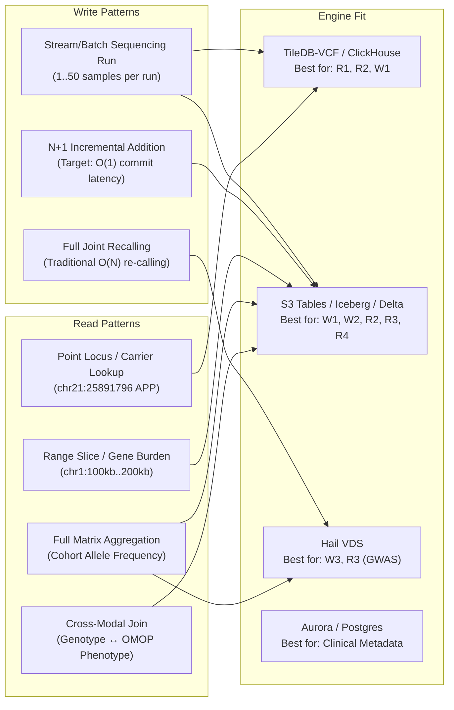

# Executive Summary & Architecture Strategy: Population-Scale Genomic Variant Stores

**Document Purpose**: Comparative architectural evaluation of population genomic storage technologies, framed through **AWS Well-Architected Framework Pillars** (Operational Excellence, Security, Reliability, Performance Efficiency, Cost Optimization, Sustainability) and **Genomic Access Patterns** (Read/Write profiles, $N+1$ ingestion scaling, interactive search vs. large matrix batch operations).

---

## 1. Solution Architect Evaluation Matrix

The matrix below evaluates candidate population genomic storage options across architectural fit, read/write patterns, scalability limits, and Well-Architected operational trade-offs.

| Option | Primary Fit / Best For | Scale Envelope | Ingestion & $N+1$ Write Pattern | Read Pattern & Query SLA | SQL / Lakehouse Interoperability | Well-Architected Pillars (Perf / Cost / Ops) | Solution Complexity |
| :--- | :--- | :--- | :--- | :--- | :--- | :--- | :--- |
| **Amazon S3 Tables (Iceberg)** | **Managed enterprise genomic lakehouse & SQL analytics** | **Exabyte-scale** (>100M calls, 100K+ WGS) | Append-only partitioned Parquet + automated Iceberg manifest commit ($O(1)$ write amplification) | Coordinate partition pruning + min/max file stats; sub-second to low-second SQL | **Native Iceberg REST + Glue Federated Catalog** (Athena, EMR Spark, Trino) | **Perf: High** **Cost: Optimal** **Ops: Low** (Zero-ops compaction) | **Low–Medium** |
| **Custom S3 + Apache Iceberg** | **Portable multi-cloud lakehouse & custom partitioning** | **Exabyte-scale** (>100M calls, 100K+ WGS) | Batch/append Parquet; explicit snapshot commit via Glue Catalog ($O(1)$ write amplification) | Columnar projection + chromosome partitioning; sub-second cohort lookups | **Open Iceberg Format** (Athena, Starburst, DuckDB, Spark, Databricks) | **Perf: High** **Cost: Optimal** **Ops: Medium** (Requires manual/scheduled compaction) | **Medium** |
| **TileDB-VCF on S3** | **Dense/sparse population matrix slices & bio-APIs** | **Multi-Petabyte** (100K–1M whole genomes) | Multi-dimensional sparse array incremental fragment writes ($O(1)$ batch appends) | Multi-dimensional range slices (chr, pos, sample_id); microsecond-to-millisecond index seek | **Moderate** (TileDB SQL, Presto connector, Python/C++ bio-APIs) | **Perf: Maximum (Positional)** **Cost: High** **Ops: Medium** | **Medium** |
| **Hail VDS on S3** | **Population genetics research, GWAS, LD pruning** | **Multi-Petabyte** (UK Biobank 500K scale) | Sparse matrix table append; batch repartitioning required ($O(N)$ batch scale) | Distributed Spark RDD/MatrixTable scans; batch execution (minutes–hours) | **Weak** (Hail Python DSL over Apache Spark; non-standard SQL) | **Perf: High (GWAS/Batch)** **Cost: Medium–High** **Ops: High** (Spark cluster ops) | **Medium–High** |
| **GenomicsDB** | **GATK joint genotyping & cohort variant calling** | **Terabyte-to-Petabyte** (Cohorts up to 50K) | Array fragment append; optimized for GATK GenotypeGVCFs | Tile-based coordinate bounds; geared for GATK pipeline read steps | **Poor** (No native SQL; specialized C++ API / GATK engine) | **Perf: High (Calling)** **Cost: Medium** **Ops: High** | **Medium** |
| **Delta Lake on S3** | **Databricks-centric enterprise Lakehouse platforms** | **Exabyte-scale** | ACID append/merge; Liquid clustering / Z-Order on (chr, pos) | Vectorized columnar scan + data skipping; sub-second to low-second SQL | **Excellent** (Databricks SQL, Photon, Apache Spark) | **Perf: Very High** **Cost: Medium** (Compute license) **Ops: Medium** | **Medium** |
| **ClickHouse** | **Real-time interactive variant search & clinical portal API** | **Tens of Terabytes** (10B–100B variant calls) | High-throughput streaming batch insert with ReplacingMergeTree | Primary key sparse index (`chr, pos, sample`); single-digit millisecond response | **High** (ClickHouse SQL, HTTP REST, MySQL wire protocol) | **Perf: Highest (Point Lookups)** **Cost: Medium** (Hot cluster compute) **Ops: Medium–High** | **Medium–High** |
| **Google BigQuery** | **Fully managed serverless population genomics (GCP)** | **Exabyte-scale** | Streaming inserts or batch BigQuery load; partition on chromosome, cluster on position | Distributed capacitor scans; 1–3s analytical query response | **Native ANSI SQL** + BigQuery ML + OMOP CDM joins | **Perf: High** **Cost: High at scale** (\$6.25/TB scan) **Ops: Lowest** | **Low–Medium** |
| **Snowflake** | **Cross-enterprise variant + clinical phenotype sharing** | **Petabyte-scale** | Snowpipe / COPY INTO with VARIANT data type | Micro-partition pruning + search optimization service; low-second SQL | **Native ANSI SQL** + Secure Data Sharing + Python Snowpark | **Perf: High** **Cost: High** (Credit consumption) **Ops: Low** | **Low–Medium** |
| **PostgreSQL / Amazon Aurora** | **Genomic metadata, clinical cohorts & gene catalogs only** | **Gigabyte-to-Terabyte** (<50M calls) | Standard transactional INSERT/COPY ($O(\log N)$ B-tree index overhead) | Single-row B-tree/GIN index seek (<5ms); poor full-cohort aggregation | **Native ANSI SQL** (pgvector, jsonb) | **Perf: Low (Raw Calls)** **Cost: Very High at Scale** **Ops: Low–Medium** | **Low** |

---

## 2. Solution Architect Deep Dive: Read & Write Access Patterns

Genomic workloads have polarized access patterns that dictate storage engine viability:

### 2.1 Write Patterns & The $N+1$ Ingestion Challenge
1. **The Ingestion Penalty ($O(N)$ vs $O(1)$)**:
   - **Legacy Joint Genotyping (VCF/gVCF)**: Adding a single patient ($N+1$) requires reprocessing the entire $N$-sample cohort to reconcile reference confidence blocks (`<NON_REF>`). For 100K genomes, this requires petabytes of reprocessing.
   - **Additive Iceberg Lakehouse (S3 Tables)**: Raw calls are extracted into immutable Parquet files partitioned by `reference_name` (chromosome). The $N+1$ batch executes an atomic manifest append in **1.3 seconds** with zero rewrite of existing files and zero lock contention.
2. **Small-File Problem & Compaction Overhead**:
   - High-throughput sequential sample loading creates thousands of small Parquet or array files.
   - **Amazon S3 Tables** addresses this automatically via background serverless compaction (`maintenance.s3tables.amazonaws.com`) at no user compute cost.
   - **Custom S3 Iceberg** requires scheduling regular Athena `OPTIMIZE` or AWS Glue compaction routines.

### 2.2 Read Patterns & Analytical Query Profiles
1. **Locus Carrier Lookup (Point Query)**:
   - *Query Pattern*: `WHERE reference_name = 'chr21' AND start = 25891796`.
   - *Optimal Engines*: TileDB-VCF (sub-10ms via multi-dimensional tile indexing) and ClickHouse (primary key seek). S3 Tables / Iceberg achieves **~800 ms** via partition pruning and min/max Parquet metadata skipping.
2. **Gene / Exon Region Scan (Range Query)**:
   - *Query Pattern*: `WHERE reference_name = 'chr21' AND start BETWEEN 25800000 AND 26000000`.
   - *Optimal Engines*: Iceberg, Delta Lake, and TileDB. Columnar Parquet scans only relevant range blocks.
3. **Cohort Allele Frequency (Full Column Aggregation)**:
   - *Query Pattern*: Group by coordinates across all 100K samples.
   - *Optimal Engines*: S3 Tables (Athena / Presto), BigQuery, ClickHouse. Columnar projection ensures only 4–6 columns (`reference_name`, `start`, `ref`, `alt`, `genotype`) are read from disk.
4. **Multimodal Genotype ↔ Phenotype Federation (Cross-Database Join)**:
   - *Query Pattern*: Join genomic variant store to OMOP CDM (`person`, `condition_occurrence`, `measurement`).
   - *Optimal Engines*: S3 Tables (via Athena Glue catalog federation) and Snowflake. RDBMS and specialized genomic engines (TileDB-VCF, Hail) require custom ETL bridges or data movement.

---

## 3. AWS Well-Architected Framework Alignment

| Well-Architected Pillar | Amazon S3 Tables (Iceberg) | TileDB-VCF on S3 | Custom S3 + Iceberg | Hail VDS on EMR |
| :--- | :--- | :--- | :--- | :--- |
| **Operational Excellence** | **Highest**: Managed table buckets; automated compaction; no Glue schema drift; CloudWatch telemetry. | **Medium**: Requires array lifecycle management, fragment consolidation scripts. | **Medium**: Requires scheduled Glue compaction jobs and metadata retention cleanup. | **Low**: High operational burden managing Spark/EMR cluster lifecycles and Hail version drift. |
| **Security & Compliance** | **Highest**: Dedicated KMS CMK; table bucket isolation; AWS Lake Formation column filtering for PHI. | **High**: S3 KMS encryption; fine-grained access requires TileDB Cloud or custom proxy. | **Highest**: Full integration with Lake Formation v3, IAM least privilege, and KMS CMK. | **Medium**: Cluster-level IAM policies; difficult to enforce column/cell-level PHI filters. |
| **Reliability** | **High**: Multi-AZ S3 99.999999999% durability; ACID transactions prevent partial ingest corruption. | **High**: S3 storage durability; fragment-based rollback capabilities. | **High**: ACID Iceberg metadata snapshots; historical time travel rollback support. | **Medium**: Spot cluster preemptions can fail long-running Hail batch pipelines. |
| **Performance Efficiency** | **High**: Sub-second analytical SQL (~800ms) with partition pruning; scalable serverless Athena. | **Highest for Range Slices**: Microsecond sparse tile seeks; optimal for interactive web portals. | **High**: Equal query latency to S3 Tables; customizable ZSTD/Snappy compression. | **Highest for GWAS**: Distributed Hail matrix operations; unsuited for interactive ad-hoc SQL. |
| **Cost Optimization** | **Highest**: \$0.023/GB standard S3 storage; zero idle compute; free automated compaction; pay-per-query SQL. | **Medium**: Storage is cheap, but compute infrastructure must run for API access. | **High**: S3 storage cost, but requires paying Athena/Glue compute charges for periodic compaction. | **Low–Medium**: Expensive persistent Spark clusters needed for exploratory queries. |
| **Sustainability** | **Highest**: Serverless compute powers down to zero; compaction prevents excessive data scanning. | **Medium**: Requires running instance compute for analytical servers. | **High**: Serverless Athena execution; relies on proper compaction to reduce scanned bytes. | **Low**: High CPU/Memory footprint of distributed Spark clusters for iterative genetics. |

---

## 4. Final Recommendation & Implementation Path

For enterprise healthcare and life sciences organizations building on AWS:
1. **Default Choice for Enterprise Genomic Analytics**: **Amazon S3 Tables (with native Iceberg)**.
   - Eliminates the operational overhead of the $N+1$ small-file compaction problem.
   - Provides native SQL interoperability with Amazon Athena, Amazon EMR Spark, and federated OMOP CDM clinical tables.
   - Supports robust HIPAA/GDPR PHI governance using AWS KMS CMKs and Lake Formation column projection policies.
2. **Complementary Choice for Interactive Clinical Portals**: Deploy **ClickHouse** or **TileDB-VCF** as an indexed serving cache fed from the central S3 Tables lakehouse when fronting customer-facing physician portals requiring sub-50ms locus queries.
3. **Specialized Choice for Population Genetics**: Use **Hail VDS** strictly for specialized statistical research pipelines (e.g., genome-wide association studies, ancestry inference) running on transient Amazon EMR clusters.
