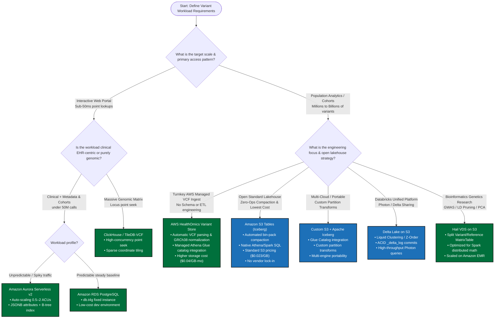

# Executive Summary & Architecture Strategy: Population-Scale Genomic Variant Stores

**Document Purpose**: Comparative architectural evaluation of population genomic storage technologies, framed through **AWS Well-Architected Framework Pillars** (Operational Excellence, Security, Reliability, Performance Efficiency, Cost Optimization, Sustainability), **Genomic Access Patterns** (Read/Write profiles, $N+1$ ingestion scaling), and an **Architectural Decision Tree** for solution selection.

---

## 1. Solution Architect Evaluation Matrix

The matrix below evaluates candidate population genomic storage options across architectural fit, read/write patterns, scalability limits, and Well-Architected operational trade-offs.

| Option | Primary Fit / Best For | Scale Envelope | Ingestion & $N+1$ Write Pattern | Read Pattern & Query SLA | SQL / Lakehouse Interoperability | Well-Architected Pillars (Perf / Cost / Ops) | Solution Complexity |
| :--- | :--- | :--- | :--- | :--- | :--- | :--- | :--- |
| **Amazon S3 Tables (Iceberg)** | **Managed enterprise genomic lakehouse & SQL analytics** | **Exabyte-scale** (>100M calls, 100K+ WGS) | Append-only partitioned Parquet + automated Iceberg manifest commit ($O(1)$ write amplification) | Coordinate partition pruning + min/max file stats; sub-second to low-second SQL | **Native Iceberg REST + Glue Federated Catalog** (Athena, EMR Spark, Trino) | **Perf: High** **Cost: Optimal** **Ops: Low** (Zero-ops compaction) | **Low–Medium** |
| **AWS HealthOmics Variant Store** | **Turnkey fully managed bioinformatics VCF ingestion** | **Petabyte-scale** (Tens of thousands of WGS samples) | Asynchronous managed VCF import jobs with automatic GRCh38 normalization | Managed Glue Data Catalog table (`omics_*`); low-second Athena SQL (~900ms) | **Proprietary managed format**; queryable via Amazon Athena; lacks open Iceberg/Delta portability | **Perf: High** **Cost: Higher** ($0.04/GB-mo + $0.005/GB import) **Ops: Lowest** (No schema or compaction management) | **Low** |
| **Custom S3 + Apache Iceberg** | **Portable multi-cloud lakehouse & custom partitioning** | **Exabyte-scale** (>100M calls, 100K+ WGS) | Batch/append Parquet; explicit snapshot commit via Glue Catalog ($O(1)$ write amplification) | Columnar projection + chromosome partitioning; sub-second cohort lookups | **Open Iceberg Format** (Athena, Starburst, DuckDB, Spark, Databricks) | **Perf: High** **Cost: Optimal** **Ops: Medium** (Requires manual/scheduled compaction) | **Medium** |
| **Delta Lake on S3** | **Databricks-centric enterprise Lakehouse platforms** | **Exabyte-scale** (>100M calls, 100K+ WGS) | ACID append/merge; Parquet + `_delta_log` JSON actions ($O(1)$ commit latency) | Vectorized columnar scan + Liquid Clustering / Z-Order data skipping; sub-second SQL | **Excellent** (Databricks SQL, Photon, Apache Spark, Athena Delta connector) | **Perf: Very High** **Cost: Medium** (Compute license) **Ops: Medium** | **Medium** |
| **Hail VDS on S3** | **Population genetics research, GWAS, LD pruning, PCA** | **Multi-Petabyte** (UK Biobank 500K scale) | Split dataset (Variant Data sparse matrix + Reference Data blocks); batch append | Distributed Spark RDD/MatrixTable parallel scans; batch execution (minutes–hours) | **Weak** (Hail Python DSL over Apache Spark; non-standard SQL) | **Perf: High (GWAS/Batch)** **Cost: Medium–High** **Ops: High** (Spark cluster ops) | **Medium–High** |
| **Amazon Aurora PostgreSQL (Serverless v2)** | **Auto-scaling clinical cohort store & interactive metadata** | **Terabyte-scale** (<100M calls, 10K samples) | ACID transactional INSERT/COPY; instant auto-scaling ACUs ($O(\log N)$ index cost) | Sub-10ms B-tree indexed carrier lookups; GIN indexed JSONB attributes; instant OLTP joins | **Native ANSI SQL** (JSONB, pgvector, full clinical EHR joins) | **Perf: High (OLTP/Point)** **Cost: Medium** (ACU scaling) **Ops: Low** (Serverless scaling) | **Low–Medium** |
| **Amazon RDS PostgreSQL (Instance)** | **Steady-state baseline metadata & clinical cohort lookup** | **Gigabyte-scale** (<20M calls) | Standard provisioned IOPS writes; fixed instance compute profile | Single-digit ms B-tree point lookups; degrades under full cohort matrix aggregations | **Native ANSI SQL** (JSONB, standard relational schemas) | **Perf: Medium** **Cost: Low (Dev baseline)** **Ops: Medium** (Patching/storage ops) | **Low** |
| **TileDB-VCF on S3** | **Dense/sparse population matrix slices & bio-APIs** | **Multi-Petabyte** (100K–1M whole genomes) | Multi-dimensional sparse array incremental fragment writes ($O(1)$ batch appends) | Multi-dimensional range slices (chr, pos, sample_id); microsecond-to-millisecond index seek | **Moderate** (TileDB SQL, Presto connector, Python/C++ bio-APIs) | **Perf: Maximum (Positional)** **Cost: High** **Ops: Medium** | **Medium** |
| **ClickHouse** | **Real-time interactive variant search & clinical portal API** | **Tens of Terabytes** (10B–100B variant calls) | High-throughput streaming batch insert with ReplacingMergeTree | Primary key sparse index (`chr, pos, sample`); single-digit millisecond response | **High** (ClickHouse SQL, HTTP REST, MySQL wire protocol) | **Perf: Highest (Point Lookups)** **Cost: Medium** (Hot cluster compute) **Ops: Medium–High** | **Medium–High** |
| **Google BigQuery** | **Fully managed serverless population genomics (GCP)** | **Exabyte-scale** | Streaming inserts or batch BigQuery load; partition on chromosome, cluster on position | Distributed capacitor scans; 1–3s analytical query response | **Native ANSI SQL** + BigQuery ML + OMOP CDM joins | **Perf: High** **Cost: High at scale** (\$6.25/TB scan) **Ops: Lowest** | **Low–Medium** |
| **Snowflake** | **Cross-enterprise variant + clinical phenotype sharing** | **Petabyte-scale** | Snowpipe / COPY INTO with VARIANT data type | Micro-partition pruning + search optimization service; low-second SQL | **Native ANSI SQL** + Secure Data Sharing + Python Snowpark | **Perf: High** **Cost: High** (Credit consumption) **Ops: Low** | **Low–Medium** |

---

## 2. Solution Architect Decision Tree

Use this decision tree to identify the optimal genomic variant store strategy based on workload characteristics, query latency SLAs, clinical integration requirements, and operational capacity:

---

## 3. Deep Dive: Amazon RDS vs. Amazon Aurora Serverless v2

When evaluating relational databases for genomic metadata and targeted variant querying, Solution Architects must weigh the structural differences between RDS PostgreSQL and Aurora Serverless v2:

| Dimension | Amazon RDS PostgreSQL | Amazon Aurora PostgreSQL (Serverless v2) | Architectural Recommendation |
| :--- | :--- | :--- | :--- |
| **Compute Architecture** | Dedicated EC2 VM instance (`db.t4g.micro`, `db.r6g.xlarge`). Fixed CPU and RAM. | Distributed compute fleet scaling dynamically in Aurora Capacity Units (0.5 to 128 ACUs) in ~instant steps. | **Aurora** handles bursty sequencer run batch writes and peak analytical portal hours without over-provisioning. |
| **Storage Subsystem** | EBS volume (gp3/io2). Manual or auto-expanding storage allocation up to 64 TiB. Single-AZ or Multi-AZ replica. | Distributed, multi-AZ log-structured storage across 6 copies in 3 AZs. Automatically scales from 10 GB to 128 TiB. | **Aurora** delivers 99.99% availability and self-healing storage without EBS volume I/O bottlenecks. |
| **Genomic Ingestion ($N+1$)** | Standard PostgreSQL `COPY` or `INSERT`. Subject to B-tree and GIN index update locks on large tables. | Accelerated write paths; handles high-throughput parallel batch ingestion without write latency spikes. | **Aurora** provides 2–3x higher throughput for concurrent clinical batch loading. |
| **Cost Profile** | Continuous billing based on instance runtime and provisioned EBS volume size (~$15–$50/mo baseline). | Billed per ACU-hour consumed (~$0.12/ACU-hr) plus storage used. Scales down to 0.5 ACU during idle periods. | **RDS** is cheaper for steady baseline dev testing; **Aurora** is cheaper for highly sporadic laboratory usage. |
| **JSONB Variant Filtering** | Full PostgreSQL JSONB operator support (`attributes->>'gene' = 'APP'`) with GIN indexing. | Full JSONB operator support with faster parallel index and bitmap scans over large datasets. | **Tie**: Both leverage native PostgreSQL JSONB indexing for flexible variant attributes. |

---

## 4. AWS Well-Architected Framework Alignment

| Well-Architected Pillar | Amazon S3 Tables (Iceberg) | Delta Lake on S3 | Custom S3 + Iceberg | Aurora Serverless v2 | Hail VDS on EMR |
| :--- | :--- | :--- | :--- | :--- | :--- |
| **Operational Excellence** | **Highest**: Zero-ops managed compaction; automated Iceberg snapshots; native CloudWatch alarms. | **High**: Databricks managed optimization; standard `OPTIMIZE` commands. | **Medium**: Requires scheduled Glue compaction jobs and metadata retention cleanup. | **High**: Zero compute sizing management; automated minor version patching and backups. | **Low**: High operational burden managing Spark/EMR cluster lifecycles and Hail version drift. |
| **Security & Compliance** | **Highest**: Dedicated KMS CMK; table bucket isolation; AWS Lake Formation column filtering for PHI. | **High**: KMS encryption; Lake Formation integration via Glue catalog. | **Highest**: Full integration with Lake Formation v3, IAM least privilege, and KMS CMK. | **Highest**: VPC private isolation; Secrets Manager credential rotation; KMS encryption at rest. | **Medium**: Cluster-level IAM policies; difficult to enforce column/cell-level PHI filters. |
| **Reliability** | **High**: Multi-AZ S3 99.999999999% durability; ACID transactions prevent partial ingest corruption. | **High**: ACID transaction log (`_delta_log`); time travel rollback support. | **High**: ACID Iceberg metadata snapshots; historical time travel rollback support. | **Highest**: 6-way storage replication across 3 AZs; instant crash recovery. | **Medium**: Spot cluster preemptions can fail long-running Hail batch pipelines. |
| **Performance Efficiency** | **High**: Sub-second analytical SQL (~800ms) with partition pruning; scalable serverless Athena. | **Very High**: Vectorized Parquet execution; Liquid clustering skips irrelevant blocks. | **High**: Equal query latency to S3 Tables; customizable ZSTD/Snappy compression. | **Highest for Point Lookups**: Single-digit ms B-tree queries; sub-100ms OMOP joins. | **Highest for GWAS**: Distributed Hail matrix operations; unsuited for interactive ad-hoc SQL. |
| **Cost Optimization** | **Highest**: \$0.023/GB standard S3 storage; zero idle compute; free automated compaction; pay-per-query SQL. | **Medium**: Storage is cheap, but requires compute runtime licenses. | **High**: S3 storage cost, but requires paying Athena/Glue compute charges for periodic compaction. | **Medium**: Scales down to 0.5 ACU ($0.06/hr) when idle; higher storage cost ($0.10/GB). | **Low–Medium**: Expensive persistent Spark clusters needed for exploratory queries. |
| **Sustainability** | **Highest**: Serverless compute powers down to zero; compaction prevents excessive data scanning. | **High**: Photon engine optimizes CPU cycles per query. | **High**: Serverless Athena execution; relies on proper compaction to reduce scanned bytes. | **High**: Dynamic scale-to-minimum compute matches true demand, eliminating idle watts. | **Low**: High CPU/Memory footprint of distributed Spark clusters for iterative genetics. |

---

## 5. Strategic Recommendations

1. **Enterprise Genomic Lakehouse Default**: Standardize on **Amazon S3 Tables** as the primary source of truth for population-scale genomic callsets. It resolves the $N+1$ small file compaction dilemma automatically and enables direct federated SQL joins to OMOP clinical tables in Athena.
2. **Databricks Ecosystem Integration**: Deploy **Delta Lake on S3** when bioinformatics pipelines are centered around Databricks Lakehouse, utilizing Liquid Clustering on `(reference_name, start)` for rapid region queries.
3. **Clinical Serving & Metadata Tier**: Use **Amazon Aurora Serverless v2 (PostgreSQL)** to store patient-sample mapping, clinical phenotype tables, and targeted pathogenic variant alerts requiring sub-10ms transactional lookups.
4. **Statistical Genetics & GWAS**: Deploy **Hail VDS on Amazon EMR** as a compute-adjacent staging format when calculating cohort-wide link disequilibrium (LD), principal component analysis (PCA), or running large-scale association studies.
